# Agentino — Architecture Audit & Redesign

> **Scope.** Complete audit of the *current* Agentino implementation and a *from-scratch* target architecture.
> Backward compatibility is **not** a constraint. Where a subsystem should disappear, this document says so.
>
> **Sources.** Everything below is grounded in the actual code: `Include/agentinodata`, `Include/agentgql`,
> `Include/agentinogql`, the `.acc` composition registries under `Partitura/AgentinoVoce.arp` and
> `Partitura/AgentinoAgentVoce.arp`, and the application shells under `Impl/`.
>
> **Implementing this? Start with [§7 Handoff kit](#7-handoff-kit-for-the-implementing-engineer)** — reading
> order, glossary, code entry points, open decisions, the normative protocol catalog, a per-step file map, and
> interface skeletons.

---

## Table of contents

1. [Executive summary](#1-executive-summary)
2. [Current architecture — analysis](#2-current-architecture--analysis)
   - 2.1 [Process & deployment topology](#21-process--deployment-topology)
   - 2.2 [Agent ↔ Server communication](#22-agent--server-communication)
   - 2.3 [Service lifecycle](#23-service-lifecycle)
   - 2.4 [Plugin system](#24-plugin-system)
   - 2.5 [Service registry & duplicated state](#25-service-registry--duplicated-state)
   - 2.6 [Service state machine](#26-service-state-machine)
   - 2.7 [Structural diagrams](#27-structural-diagrams)
   - 2.8 [Service connections & cross-agent wiring (as-built)](#28-service-connections--cross-agent-wiring-as-built)
3. [Problems — full catalog](#3-problems--full-catalog)
4. [Proposed architecture](#4-proposed-architecture)
   - 4.1 [Design principles](#41-design-principles)
   - 4.2 [Subsystem overview](#42-subsystem-overview)
   - 4.3 [Agent architecture](#43-agent-architecture)
   - 4.4 [Server architecture](#44-server-architecture)
   - 4.5 [Wire protocol redesign](#45-wire-protocol-redesign)
   - 4.6 [Service lifecycle redesign](#46-service-lifecycle-redesign)
   - 4.7 [Plugin architecture redesign](#47-plugin-architecture-redesign)
   - 4.8 [Ownership model](#48-ownership-model)
   - 4.9 [Data model](#49-data-model)
   - 4.10 [Event flows](#410-event-flows)
   - 4.11 [Dependency graph](#411-dependency-graph)
   - 4.12 [Service connections & cross-agent wiring](#412-service-connections--cross-agent-wiring)
   - 4.13 [Agent enrollment & approval](#413-agent-enrollment--approval)
   - 4.14 [Composition & ACC file structure](#414-composition--acc-file-structure)
5. [Migration roadmap](#5-migration-roadmap)
6. [GUI (QML) architecture & improvement plan](#6-gui-qml-architecture--improvement-plan)
   - 6.1 [Current QML — analysis](#61-current-qml--analysis)
   - 6.2 [Problems (QML)](#62-problems-qml)
   - 6.3 [Target layered architecture](#63-target-layered-architecture)
   - 6.4 [Port catalog (the view-model interfaces)](#64-port-catalog-the-view-model-interfaces)
   - 6.5 [Reusability & the composition root](#65-reusability--the-composition-root)
   - 6.6 [New GUI surfaces for the new backend](#66-new-gui-surfaces-for-the-new-backend)
   - 6.7 [The ImtCore boundary](#67-the-imtcore-boundary)
   - 6.8 [QML migration steps](#68-qml-migration-steps)
7. [Handoff kit (for the implementing engineer)](#7-handoff-kit-for-the-implementing-engineer)
   - 7.1 [How to read this document](#71-how-to-read-this-document)
   - 7.2 [Glossary (ACF / ImtCore / Agentino)](#72-glossary-acf--imtcore--agentino)
   - 7.3 [Code entry points](#73-code-entry-points)
   - 7.4 [Open decisions & assumptions](#74-open-decisions--assumptions)
   - 7.5 [Normative protocol message catalog](#75-normative-protocol-message-catalog)
   - 7.6 [File map by roadmap step](#76-file-map-by-roadmap-step)
   - 7.7 [Interface skeletons](#77-interface-skeletons)

---

## 1. Executive summary

Agentino is a distributed service-management system: a central **Agentino Server** manages many **Agents**,
each of which starts/stops/monitors OS processes ("services") on its host machine, resolves a local
dependency **topology**, and streams status and logs. There are three shells — `AgentinoAgent` (headless
server-on-a-host), `AgentinoServer`/`AgentinoClientServer` (central GUI), and `AgentinoClient` (thin GUI) —
all assembled from ACF components declared in `.acc` registries.

The **core idea is sound** and one part of it is genuinely good: *the agent is the source of truth for its
own services* (persisted in `ServicesSettings.xml`), and the server keeps a **mirror**. But the
*implementation of that idea* is where the architecture breaks down. The audit finds:

- **Duplicated runtime state with no single writer.** A service's identity/config lives in the agent's
  `ServiceCollection`; it is copied into a **per-agent nested mirror collection** inside each server-side
  `CAgentInfo`; its status lives in a **third**, separate `ServiceStatusCollection`. These three are kept in
  sync by *five different mechanisms* (proxy mutations, live push, full reconcile on connect, a 500 ms timer,
  and status subscriptions), several of which overlap. See [§2.5](#25-service-registry--duplicated-state).

- **Status is derived by polling the OS, not owned.** `CServiceControllerComp` has no event source for
  process death: it polls every 5 s, scans the entire process table by normalized executable path, and kills
  with `system("taskkill …")` / `system("pkill …")`. The "state machine" is a tangle of tick counters
  (`s_maxStartingTicks`, `countOfStarting > 4`, `> 3`) rather than an explicit FSM. See
  [§2.3](#23-service-lifecycle) / [§2.6](#26-service-state-machine).

- **The agent is simultaneously a WebSocket *server* and a WebSocket *client*,** sharing one handler factory
  and two near-identical subscriber lists. This bidirectional/reentrant design is the direct cause of the
  threading hazards documented *in the code itself* (worker threads vs. WS I/O thread, manual `QueueHandle…`
  hops, re-entrancy guards like `m_agentsBeingReconciled`). See [§2.2](#22-agent--server-communication).

- **"Mirror" objects are overloaded God-components.** The server wires a single `AgentRepository` component in
  as `AgentCollection`, `ObjectCollection`, **and** `ServiceManager` at once (`Pages.acc`). `CAgentInfo` is a
  data record that also *owns a live model + a nested collection + an update bridge*.

- **Massive copy-paste from sibling products.** The server composite (`Server.acc`, `Handlers.acc`) still
  carries ProLife/Lisa licensing scaffolding: GraphQL command id `Lisa/graphql`, HTTP routes `ProLife/Views/*`,
  a Postgres `lisa` database with a hard-coded password, and Account/Product/Installation/Feature controllers
  that have nothing to do with agent management.

- **Hard-coded security.** The agent's upstream WebSocket client logs in with `ServerLoginParam=su` /
  `ServerPasswordParam=1` and `ClientId=1111` baked into `AgentServer.acc`.

The target architecture (Part 4) collapses the three stores into **one authoritative store per side** with a
**single writer**, replaces polling with an **event-sourced supervisor**, makes the agent a **pure server**
(the central server dials *out* to agents, one direction), and replaces the shared-handler/reentrant model
with a **stateless command / typed-event protocol** with explicit sequence numbers and resync.

---

## 2. Current architecture — analysis

### 2.1 Process & deployment topology

| Process | Shell (`.acc`) | Framework | Role |
|---|---|---|---|
| **Agent** | `AgentinoAgent.acc` → `AgentServer` (`AgentinoAgentVoce`) | `ServiceApplicationFramework` (headless) | Runs services on a host; source of truth for its own service collection & topology. |
| **Central server** | `AgentinoClientServer.acc` / `AgentinoServer.acc` → `ServerBase` (`AgentinoVoce`) | `QmlClientFramework` + GQL server | Aggregates/mirrors all agents; hosts the operator GUI + GraphQL. |
| **Thin client** | `AgentinoClient.acc` | `QmlClientFramework` | Operator GUI that talks GraphQL to a server (or directly to an agent). |

The agent binds an **HTTP server** (`DefaultHttpPort=7222`) and a **WebSocket server**
(`DefaultWebSocketPort=7223`) via `HttpServerFramework` + `WebSocketServerFramework`, **and** opens a
**WebSocket client** (`WebSocketClient`, embedding `ImtClientGqlPck::WebSocketClient` + `WebSocketServlet` +
`WorkerManager`) up to the central server. So the agent is both a server (for its own GUI/clients) and a
client (to the central server) at the same time.

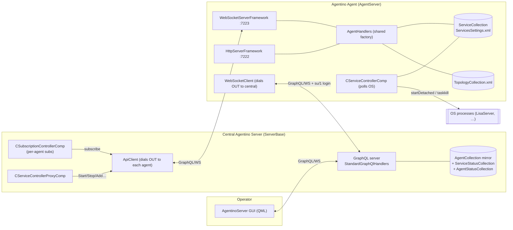

> **Note the two arrows between Agent and Central.** `APIC → WSS` (central pulls/commands the agent) and
> `WSC → SGQL` (agent pushes to central). The system uses *both directions on two different sockets*.

### 2.2 Agent ↔ Server communication

**Transport.** GraphQL-over-WebSocket, using the ImtCore stack (`imtclientgql`, `imtservergql`, `imtrest`).
The agent's upstream link is `AgentinoAgentVoce.arp/AgentServer.acc → WebSocketClient`, an embedded registry
combining:

- `ImtClientGqlPck::WebSocketClient` — the dialer. Hard-coded `ClientId=1111`, `ProductId=Agent`,
  `ServerLoginParam=su`, `ServerPasswordParam=1`.
- `ImtServerGqlPck::WebSocketServlet` + `ImtRestPck::WorkerManager` (`ThreadsLimit=100`) — meaning the "client"
  link *also serves inbound requests* on worker threads. The connection is **bidirectional and reentrant**.

**Authentication.** `AuthenticationManager` + `JwtSessionController` (from `ImtAuthVoce`) with a local SQLite
user repository. The agent authenticates upward with static `su`/`1` credentials. There is no per-agent
identity/rotation; `ClientId=1111` is shared by construction.

**Connection state ownership.** Split across:
- `WebSocketClient/ConnectionStatusProvider` (exports `imtcom::IConnectionStatusProvider` + `imod::IModel`).
- `agentgql::CAgentinoSubscriptionClientComp` — observes `WebLoginStatus`; on connect (re)registers the
  upstream `OnAgentServiceStatusChanged` subscription.
- `agentgql::CAgentConnectionSubscriberControllerComp` — publishes `OnAgentConnectionChanged` to the central.
- `agentinogql::CAgentConnectionObserverComp` (central) — observes login status, flips `AgentStatusInfo` and
  marks that agent's services.

No single component owns "is this agent connected"; at least four do, on both ends.

**Subscription channels** (command ids are the contract). From `AgentSubscribers.acc` +
`CSubscriptionControllerComp`:

| Command id | Direction | Purpose |
|---|---|---|
| `OnServicesCollectionChanged` | agent → local GUI (WS **server**) | Local service collection changed. |
| `OnServiceStatusChanged` | agent → local GUI (WS **server**) | Local status changed (publish-only; agent has no status collection). |
| `OnAgentServicesCollectionChanged` | agent → central (WS **client**) | Mirror-sync trigger. |
| `OnAgentServiceStatusChanged` | agent → central (WS **client**) | Live status into central `ServiceStatusCollection`. |
| `OnAgentConnectionChanged` | agent → central | Online/offline. |
| `OnServiceLogCollectionChanged` / `OnAgentLogCollectionChanged` | agent → central | Log streaming. |
| `NotifyAgentServicesCollectionChanged` | agent → central (command, not sub) | Direct notify handled by `CServiceControllerProxyComp::HandleAgentServiceCollectionNotify`. |

The *same* subscriber controllers (`RemoteServiceCollectionSubscriberController`,
`ServiceStatusSubscriberController`, `AgentConnectionSubscriberController`, …) appear in **both** the
`WebSocketServer`'s and the `WebSocketClient`'s `GqlSubscriberControllers` arrays — one physical controller,
two links.

**Request/response & mutation flow (central → agent).** The central server never mutates a service directly.
`CServiceControllerProxyComp` (registered as the `Services` GQL handler) forwards `AddService`,
`UpdateService`, `StartService`, `StopService`, `ServicesRemove`, `LoadPlugin`, `GetServiceSettings`,
`UpdateServiceSettings` to the owning agent over the `ApiClient`, then writes the result into the mirror.

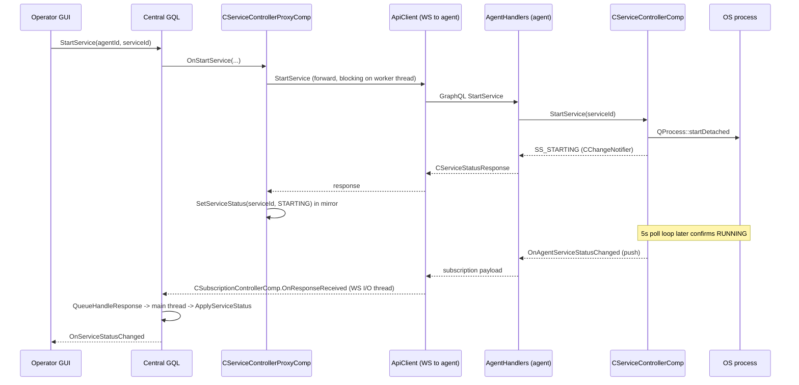

**The threading hazard is documented in the code.** `CSubscriptionControllerComp`'s header comment states:
`OnResponseReceived` runs on the WS I/O thread while `StartService/StopService` run on GQL worker threads with
*nested event loops*, so all mirror mutation must be hand-queued to the main thread "to avoid races that
freeze workers and leave the server unable to handle subsequent commands (e.g. `SaveTopology`) until the client
reconnects." `CServiceControllerProxyComp` carries a re-entrancy guard set `m_agentsBeingReconciled` because
`SendModelRequest` spins a nested event loop. These are symptoms, not incidental details.

**Reconnection & resync.** On every agent (re)connect, `CAgentCollectionControllerComp` (500 ms timer,
`m_connectedAgents`) calls `IServiceCollectionSynchronizer::SyncAgentServicesInMirror` — a **full** pull of the
agent's `ServicesList` + per-service `GetService`, removing mirror entries that no longer exist, then a status
refresh. `CSubscriptionControllerComp::EnsureLiveSubscriptionsForAgent` re-opens the two live subscriptions
because "agent-side subscriber lists were wiped on disconnect." There is **no heartbeat** and **no sequence
number / version**: resync is always a full snapshot, and liveness is inferred from login status + the reconcile
timer.

### 2.3 Service lifecycle

Two distinct meanings of "service" collide in the codebase:

1. **ACF component lifecycle** — every component gets `OnComponentCreated()` / `OnComponentDestroyed()` from
   the ACF container; DI is resolved from the `.acc` registry (`I_ASSIGN`/`I_REF`/`I_FACT`). The application
   framework drives creation order via `ComponentsToInitialize`.
2. **Managed OS-process lifecycle** — the thing operators actually call a "service": an executable on the
   agent host, started/stopped/monitored by `agentinodata::CServiceControllerComp`.

The managed-service lifecycle is entirely inside `CServiceControllerComp`
(`Include/agentinodata/CServiceControllerComp.cpp`):

- **Create/register:** a service is a row in `ServiceCollection` (`CIdentifiableServiceInfo`), persisted to
  `ServicesSettings.xml` by `FileAutoPersistence` (`StoreOnChange=true`).
- **Init:** `OnComponentCreated()` iterates all rows; if `IsAutoStart()` and not running → `SetupService(id, true)`.
  It starts a **single 5 s `QTimer`** for the whole component.
- **Start:** `StartService` → `SetupService(id, true)`. Either runs a start *script* (`GetStartScriptPath`) via
  `QProcess::startDetached`, or the executable directly; tracks the returned PID; emits `SS_STARTING` then
  possibly `SS_RUNNING`.
- **Monitor:** `OnTimeout()` every 5 s walks `m_processMap`, calls `IsServiceProcessAlive` (tracked PID
  liveness *or* a full process-table scan matching normalized exe path), and nudges the status with counters.
- **Stop:** `StopService` resolves a PID (tracked or by scan) and shells out: `taskkill /f /pid` (Win), `kill
  SIGKILL` (Linux), `SIGTERM`→`SIGKILL` escalation (macOS), with an image-name `taskkill /im` / `pkill -f`
  fallback.
- **Restart:** only implicit — in `OnTimeout`, a service that *was* running, is `IsAutoStart()`, and has
  disappeared is re-`StartService`d; after `countOfStarting > 3` it latches to `SS_RUNNING_IMPOSSIBLE`.
- **Destroy:** `OnComponentDestroyed()` stops every service whose last status was `RUNNING`/`STARTING`, then
  clears `m_processMap` and `m_pluginMap`.

**Ownership.** `CServiceControllerComp` owns `m_processMap` (PID + last status + counters) and `m_pluginMap`
(one `PluginManager` per service). The service *config* is owned by `ServiceCollection`. Status has **no
persistent owner** — it is recomputed on demand from the OS.

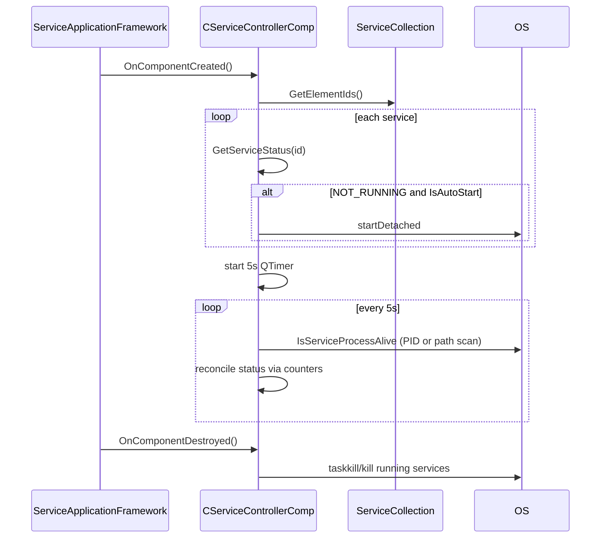

### 2.4 Plugin system

There are **two unrelated "plugin" systems**, which is itself a source of confusion:

**(a) ACF component packages** — the real extensibility mechanism. `.arp` package folders
(`AgentinoVoce.arp`, `AgentinoAgentVoce.arp`) and `Pck`/`Voce` libraries (`AgentinoDataPck`, `AgentGqlPck`,
`AgentinoGqlPck`, …) register components (`I_BEGIN_COMPONENT`/`I_REGISTER_INTERFACE`), which the `.acc`
registries instantiate and wire by reference. This is compile-time-declared, load-time-resolved DI. It is how
*the application itself* is assembled and is not per-managed-service.

**(b) Per-service settings plugins** — `imtbase::TPluginManager<imtservice::IConnectionCollectionPlugin>`,
loaded at runtime by `CServiceControllerComp::UpdateServiceVersion`:

- Discovery: for a service whose executable is at `…/Foo.exe`, it looks in `…/Plugins` and calls
  `LoadPluginDirectory(pluginPath, "plugin", "ServiceSettings")`.
- Loading: dynamic libraries via `IMT_DECLARE_PLUGIN_INTERFACE(ServiceSettings, …)` create/destroy functions.
- Matching: it selects the plugin whose `GetPluginName() == Foo + "Settings"`.
- Use: obtains an `IConnectionCollectionFactory`, creates an `IConnectionCollection`, reads
  `GetServiceVersion()`, and — if changed — writes it back into `ServiceInfo` and re-persists the collection.
- Registration/DI: none in the ACF sense — plugins are not registered into any container, they are a
  side-channel to read a service's declared connection model + version.
- Unloading: `m_pluginMap.clear()` at component destruction (and on load failure). A `PluginManager` is created
  **per service, every time** `UpdateServiceVersion` runs (i.e. on every `SetupService`), so plugins are
  repeatedly reloaded.

There is also `OnLoadPlugin` on the proxy (`CLoadPluginGqlRequest`) exposing plugin info over GQL, and
`OnGetServiceSettings`/`OnUpdateServiceSettings` for editing the connection collection a plugin describes.

### 2.5 Service registry & duplicated state

This is the architectural center of gravity — and the biggest problem. There are **three** stores of the same
conceptual data, plus a topology store:

| Store | Where | Owner | Contents | Persistence |
|---|---|---|---|---|
| **Agent `ServiceCollection`** | agent, `Repositories/ServiceCollection` | agent (authoritative) | `ServiceInfo` per service | `ServicesSettings.xml` (`FileAutoPersistence`) |
| **Server mirror** | central, `CAgentInfo::GetServiceCollection()` — a **nested** `CObjectCollection` *inside each agent record* in `AgentCollection` | central (copy) | mirrored `ServiceInfo` per service per agent | none (rebuilt on connect) |
| **Server `ServiceStatusCollection`** | central, flat collection keyed by serviceId | central (copy) | `CServiceStatusInfo` (status only) | none |
| **`TopologyCollection`** | *both* sides, local x/y layout | each side, independently | `Position2d` per service | `TopologyCollection.xml` (agent) |

`CAgentInfo` (`Include/agentinodata/CAgentInfo.h`) is a *data record* that also embeds
`imod::TModelWrap<imtbase::CObjectCollection> m_serviceCollection` and a `CModelUpdateBridge` — i.e. every
agent record privately owns a live, observable sub-collection. The server thus stores services as
`AgentCollection[agentId].serviceCollection[serviceId]`, **and separately** as
`ServiceStatusCollection[serviceId]`.

Keeping them consistent requires **five** overlapping mechanisms:

1. **Proxy mutations** (`CServiceControllerProxyComp`) — forward to agent, then write mirror (`SyncServiceInMirror`).
2. **Live push** (`OnAgentServicesCollectionChanged` / `NotifyAgentServicesCollectionChanged`) —
   `HandleServiceCollectionChanged` reconciles mirror.
3. **Full reconcile on connect** (`SyncAgentServicesInMirror`, driven by `CAgentCollectionControllerComp`'s
   500 ms timer).
4. **Status subscription** (`OnAgentServiceStatusChanged`) — `ApplyServiceStatus` writes `ServiceStatusCollection`.
5. **Stale-by-path cleanup** (`RemoveStaleMirrorServicesByPath`) — because a service recreated with a new UUID
   after a missed remove would otherwise show a ghost row.

The very existence of mechanism (5) is proof the model has no single writer: identity is not stable across the
sync channels, so the code compensates by matching on executable path.

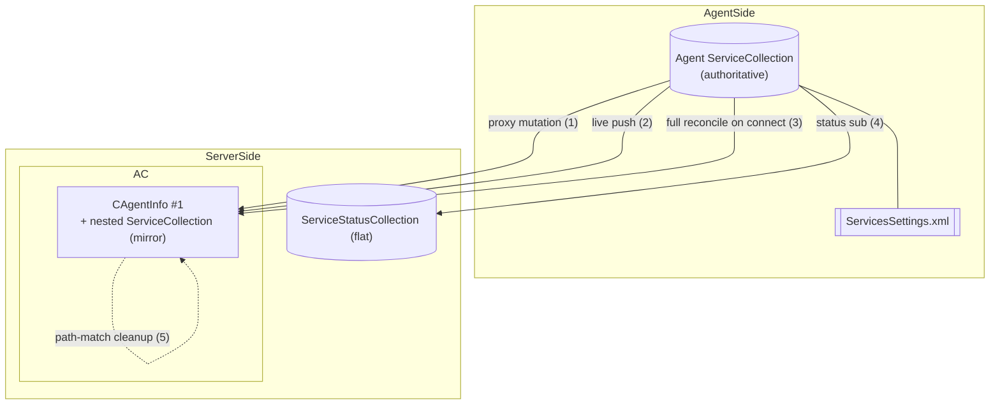

### 2.6 Service state machine

States (`agentinodata::IServiceStatusInfo::ServiceStatus`):
`SS_UNDEFINED`, `SS_STARTING`, `SS_STOPPING`, `SS_RUNNING`, `SS_NOT_RUNNING`, `SS_RUNNING_IMPOSSIBLE`.

There is **no explicit transition table**. Transitions are emitted ad hoc from `SetupService`, `StopService`,
and `OnTimeout` and gated by counters:

- `s_maxStartingTicks = 12` (~60 s) — how long `STARTING` may persist without a visible process before →
  `NOT_RUNNING`.
- `countOfStarting > 4` while `STOPPING` but process still alive → accept `RUNNING`.
- `countOfStarting > 3` while auto-start and process gone → `RUNNING_IMPOSSIBLE`.

Reconstructed FSM (as-built):

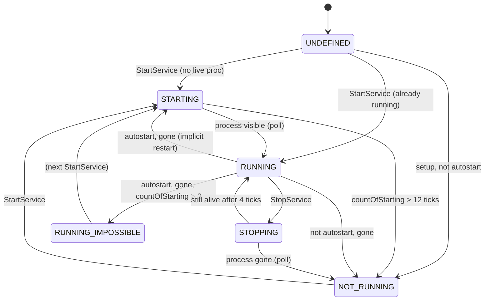

**Who changes status & how it propagates.**
- *Producer:* `CServiceControllerComp::EmitChangeSignal` on the agent → `CChangeNotifier(CN_STATUS_CHANGED)`.
- *Agent GUI:* `LocalServiceStatusSubscriberController` → `OnServiceStatusChanged`.
- *Central:* `ServiceStatusSubscriberController` → `OnAgentServiceStatusChanged` → `CSubscriptionControllerComp`
  → `ServiceStatusCollection` → `OnServiceStatusChanged` to operator GUI.

**Race conditions / invalid transitions (observed in code):**
- Status is emitted from whichever thread called `StartService` (often a GQL worker), while the 5 s poll runs on
  the component's thread — `EmitChangeSignal` mutates `m_processMap[id].lastStatus` from both without a lock.
- The central re-derives a *second* status opinion from responses (`PXY.SetServiceStatus`) that can race the
  push subscription; ordering between "reconcile on connect" and "live push" is not defined, hence the
  re-entrancy guard and path-cleanup.
- `SS_RUNNING_IMPOSSIBLE` is declared in the enum but excluded from `I_DECLARE_ENUM(...)`, so it does not
  round-trip through serialization the way the others do — a latent representation gap.

### 2.7 Structural diagrams

**Component diagram (managed-service plane).**

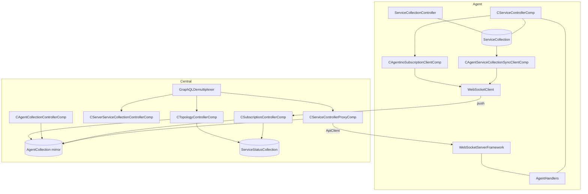

**Package dependency graph.**

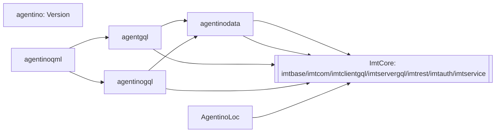

**Ownership diagram (as-built) — note the overloaded nodes.**

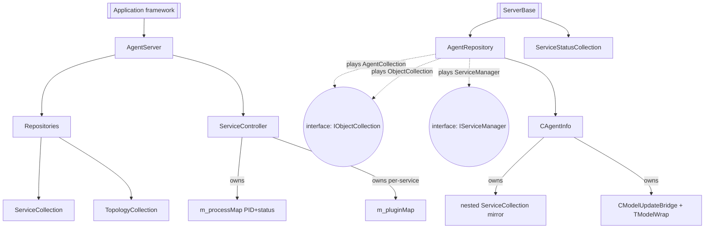

### 2.8 Service connections & cross-agent wiring (as-built)

This is a domain concern the rest of the audit only touched in passing, but it drives much of the server's
reason to exist, so it is modeled explicitly here.

**A service's connection points come from its plugin.** `imtservice::IConnectionCollectionPlugin` exposes an
`IConnectionCollection` (`Include/imtservice/…`). That collection declares typed connection points —
`IServiceConnectionInfo` with `ConnectionType ∈ {CT_INPUT, CT_OUTPUT}`, a `GetServiceTypeId()` (e.g. `Lisa`),
and a default `imtcom::IServerConnectionInterface` (URL / host / port). So the plugin is the **schema author**:
*ProLife's* plugin declares a **Lisa output** connection; *Lisa's* plugin declares an **input** endpoint.

On the service record (`agentinodata::IServiceInfo`) this surfaces as two collections:

| Accessor | Meaning | Example |
|---|---|---|
| `GetInputConnections()` | Endpoints this service **exposes/provides** (connectable *targets*). Each is a `imtservice::CUrlConnectionParam` (a server-connection URL). | Lisa exposes an input endpoint at `host:port`. |
| `GetDependantServiceConnections()` | Endpoints this service **consumes** (its outputs / dependencies), each bound to a chosen target via a `dependantConnectionId`. | ProLife's `Lisa` output, bound to a specific Lisa. |

**The pick-list is built fleet-wide on the server.** `CServiceControllerProxyComp::GetConnectionsModel`
(`…/CServiceControllerProxyComp.cpp:1123`) iterates **every** agent in `AgentCollection`, walks each mirrored
service's connections, and appends matches (`agentinodata::AppendAvailableConnectionsFromServiceCollection`).
So when the editor offers "which Lisa do you want to connect ProLife to?", the *N candidates from N different
agents* come from the server's mirror — **not** from the agent. Individual agents never enumerate each other.

**Binding materializes as a plain URL copied into the consumer.** Selecting a target sets the output's
`dependantConnectionId` to the chosen input connection's element id; `UpdateUrlFromDependantConnection`
(`:1210`) resolves that id to a concrete URL by scanning all agents' input connections
(`GetDependantServerConnectionParam`, `:1237`) and **cloning the target's `CUrlConnectionParam`** into the
consumer's output connection (`connectionParam`). That URL is then written into the consumer service's
descriptor and pushed down to the consumer's agent via the `clientid` (= agentId) header. At runtime the
ProLife **process** simply dials that host:port — there is no agent-to-agent control channel.

**Producer URL changes fan out to consumers, centrally.** `OnUpdateConnectionUrl` (`:705`) →
`GetServiceIdsByDependantId` (`:1345`) finds every service (across all agents) whose
`GetDependantServiceConnections()` references the changed connection id, then `UpdateConnectionForService`
pushes the new URL to each consumer's agent. Again: the server orchestrates; agents stay mutually ignorant.

**Local-only wiring bypasses the server.** If both services live on the same agent, they can be bound on the
agent alone (the agent holds both descriptors + both connection collections locally). Cross-agent binding is
the case that *requires* the server's fleet-wide catalog.

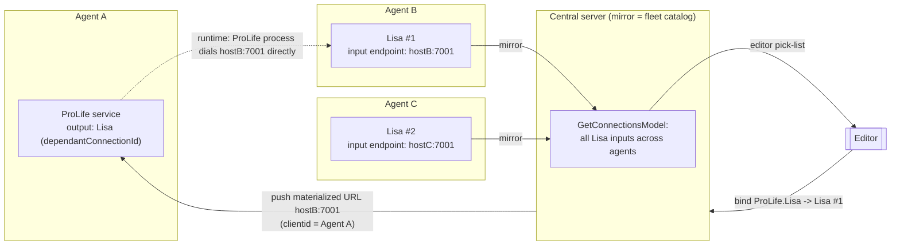

**As-built weaknesses specific to connections** (folded into [P15](#p15--connection-wiring-relies-on-fleet-wide-linear-scans--unstable-connection-ids)):
resolution is O(agents × services × connections) linear scans on every query; connection identity is a bare
element id resolved by scanning the mirror (same fragility as service identity in [P1](#p1--triplicated-service-state-with-no-single-source-of-truth-on-the-server)/[P9](#p9--kill-by-image-name-and-path-based-identity-are-unsafe));
the advertised URL must be routable from the *consumer's* host, but nothing validates reachability or
distinguishes a loopback default from a fleet-routable address; and an offline producer leaves consumers
pointing at a stale URL with no explicit "endpoint unavailable" state.

---

## 3. Problems — full catalog

Each problem: **description → root cause → consequences → violated principles → direction.**

### P1 — Triplicated service state with no single source of truth on the server
- **Description.** Service config exists in the agent collection, in a per-agent nested mirror, and (status)
  in a flat `ServiceStatusCollection`; kept in sync by five mechanisms ([§2.5](#25-service-registry--duplicated-state)).
- **Root cause.** `CAgentInfo` embeds its own collection; status was split into a second collection for
  subscription convenience. No component is *the writer*.
- **Consequences.** Ghost rows (needs `RemoveStaleMirrorServicesByPath`), status/identity races, five code paths
  to change one fact, "freeze until reconnect" bugs.
- **Violates.** SRP (records own live sub-stores), Single Source of Truth, DRY, low coupling.
- **Direction.** One authoritative store per side, one writer, status as a field of the service projection —
  not a parallel collection. ([§4.4](#44-server-architecture), [§4.9](#49-data-model))

### P2 — Status is polled, not owned/evented
- **Description.** No signal on process death; a 5 s timer + full process-table scans + `system("taskkill")`.
- **Root cause.** Services are detached (`startDetached`) with no supervision handle; the controller is a
  monitor, not a supervisor.
- **Consequences.** Up to 5 s status latency, O(processes) scans each tick, brittle path normalization, kills by
  image name can hit unrelated processes, counter-driven pseudo-FSM.
- **Violates.** Event-driven principle, SRP (one class does spawn+scan+kill+FSM+plugins+logging), OCP.
- **Direction.** Event-sourced `ServiceSupervisor` owning a child handle per service; OS notifies death;
  explicit FSM. ([§4.6](#46-service-lifecycle-redesign))

### P3 — Agent is both WS server and WS client with shared, reentrant handlers
- **Description.** One `AgentHandlers` factory + two overlapping subscriber lists serve both links; the "client"
  embeds a servlet + 100-thread worker manager.
- **Root cause.** Reusing the full server servlet stack to get a bidirectional channel to the central server.
- **Consequences.** Worker-thread vs I/O-thread races (documented), manual `QueueHandle…` hops, nested event
  loops, re-entrancy guards, "server can't handle SaveTopology until reconnect."
- **Violates.** Low coupling, SRP, principle of least astonishment; effectively no module boundary between
  client and server roles.
- **Direction.** One **disciplined async protocol** over a single WebSocket per agent (transport settled):
  commands down, events up, correlated, no shared servlet and no nested event loops. Which side dials is a
  separate, still-open deployment choice. ([§4.4](#44-server-architecture), [§4.5](#45-wire-protocol-redesign))

### P4 — Connection/liveness state is scattered and duplicated
- **Description.** "Is the agent online?" is decided by `ConnectionStatusProvider`,
  `CAgentinoSubscriptionClientComp`, `CAgentConnectionSubscriberControllerComp`, and
  `CAgentConnectionObserverComp`.
- **Root cause.** No single connection/session aggregate; liveness inferred from login + reconcile timer, no
  heartbeat.
- **Consequences.** Ambiguous offline detection, redundant re-registration, timer-driven reconciles.
- **Violates.** SSOT, SRP, clear ownership.
- **Direction.** One `AgentSession` aggregate per connection with heartbeats and an explicit state machine.
  ([§4.4](#44-server-architecture))

### P5 — Overloaded God-components (`AgentRepository`, `CAgentInfo`, `CServiceControllerComp`)
- **Description.** `AgentRepository` is wired simultaneously as `AgentCollection`, `ObjectCollection`, and
  `ServiceManager` (`Pages.acc`); `CServiceControllerComp` spawns, scans, kills, runs the FSM, loads plugins,
  and logs.
- **Root cause.** Interface-role reuse to save components; no separation of responsibilities.
- **Consequences.** Untestable units, change amplification, unclear ownership.
- **Violates.** SRP, ISP.
- **Direction.** Split by responsibility; one role per component. ([§4.3](#43-agent-architecture)–[§4.4](#44-server-architecture))

### P6 — Full-snapshot resync, no protocol versioning/heartbeat/sequence
- **Description.** Every reconnect pulls the entire `ServicesList` + each `GetService`; liveness via timers.
- **Root cause.** No per-collection version/sequence; no delta protocol.
- **Consequences.** O(services) traffic on every reconnect, races between reconcile and live push, no way to
  detect missed events except full pull.
- **Violates.** Predictable synchronization, scalability.
- **Direction.** Monotonic `revision` per collection; `Resync(sinceRevision)` returns a delta; heartbeat.
  ([§4.5](#45-wire-protocol-redesign))

### P7 — Hard-coded credentials and shared client id
- **Description.** `ServerLoginParam=su`, `ServerPasswordParam=1`, `ClientId=1111`, DB password `12345` (Postgres
  `lisa`) in committed `.acc`.
- **Root cause.** Copy-paste + demo wiring left in place.
- **Consequences.** No per-agent identity, no rotation, insecure by default, all agents indistinguishable.
- **Violates.** Security, clear ownership of identity.
- **Direction.** Per-agent enrollment (key/token), no secrets in composition files. ([§4.5](#45-wire-protocol-redesign))

### P8 — Copy-pasted foreign product scaffolding in the server composite
- **Description.** `Server.acc`/`Handlers.acc` carry Lisa/ProLife licensing controllers, `Lisa/graphql`,
  `ProLife/Views/*`, Account/Product/Installation/Feature repositories — unrelated to agent management.
- **Root cause.** The server was cloned from the Lisa/ProLife server composite.
- **Consequences.** Huge dead surface, confusing routes, unnecessary Postgres dependency, security exposure,
  slow builds, misleading docs.
- **Violates.** YAGNI, low coupling, cohesion.
- **Direction.** Delete. The Agentino server needs agent/service/topology + auth only. ([§4.4](#44-server-architecture), [§5](#5-migration-roadmap))

### P9 — Kill-by-image-name and path-based identity are unsafe
- **Description.** Stop falls back to `taskkill /im Foo.exe` / `pkill -f Foo`; "is it running" matches by
  normalized exe path; mirror de-dupes by path.
- **Root cause.** No durable child handle / service instance id tied to a PID.
- **Consequences.** Can kill unrelated processes sharing an image name; two services pointing at the same
  binary are indistinguishable; ghost rows.
- **Violates.** Correctness, clear ownership of a running instance.
- **Direction.** Own the child process; identify by supervised handle, never by image name. ([§4.6](#46-service-lifecycle-redesign))

### P10 — Plugins reloaded per start; two meanings of "plugin"
- **Description.** A fresh `PluginManager` per service is created on every `SetupService`;
  ACF-packages vs. service-settings-plugins share the word "plugin."
- **Root cause.** Version read is coupled into the start path; no plugin cache/registry.
- **Consequences.** Repeated dlopen/dlclose, wasted work, terminology confusion.
- **Violates.** SRP, performance predictability.
- **Direction.** A `ServiceTypeCatalog` loads a plugin once per service *type* and caches capability metadata.
  ([§4.7](#47-plugin-architecture-redesign))

### P11 — Topology layout entangled with (but excluded from) sync
- **Description.** `TopologyCollection` x/y are per-side and *must not* be synced, yet live in the same plane as
  service data and are refreshed by the same event storm.
- **Root cause.** Layout (view concern) mixed into the domain/sync layer.
- **Consequences.** Special-case rules ("must not be synced"), coupling of view state to domain events.
- **Violates.** Separation of concerns.
- **Direction.** Layout is a pure client/view concern keyed by serviceId, never in the domain event stream.
  ([§4.9](#49-data-model))

### P12 — GUI-embedded server (`AgentinoClientServer`) mixes shells/concerns
- **Description.** The operator GUI process embeds the whole server (`ServerBase`) via
  `ComponentsToInitialize`, so UI, GraphQL server, mirror, and outbound agent dialer share one process/event
  loop.
- **Root cause.** Convenience packaging.
- **Consequences.** GUI stalls affect server I/O and vice-versa; hard to scale/deploy headless.
- **Violates.** Low coupling, deployability.
- **Direction.** Server is headless and independently deployable; GUI is a pure GraphQL client. ([§4.2](#42-subsystem-overview))

### P13 — Ownership of runtime status has no home
- **Description.** Status is recomputed from the OS on the agent and *copied* into a server collection; nobody
  durably owns "current status."
- **Root cause.** Derivation instead of ownership (see P2).
- **Consequences.** Two divergent opinions (agent poll vs. server response-derived), UNDEFINED flicker on
  offline.
- **Violates.** Clear ownership, SSOT.
- **Direction.** Agent supervisor owns status; server holds a *projection* stamped with revision + observedAt.
  ([§4.9](#49-data-model))

### P14 — `RUNNING_IMPOSSIBLE` enum/serialization gap
- **Description.** Present in the enum, absent from `I_DECLARE_ENUM`.
- **Root cause.** Enum extended without updating the reflection macro.
- **Consequences.** Inconsistent (de)serialization/representation of the failure state.
- **Violates.** Correctness/consistency.
- **Direction.** Model a proper `Failed{reason}` terminal state, fully represented. ([§4.6](#46-service-lifecycle-redesign))

### P15 — Connection wiring relies on fleet-wide linear scans & unstable connection ids
- **Description.** Cross-agent connection resolution (`GetConnectionsModel`, `GetDependantServerConnectionParam`,
  `GetServiceIdsByDependantId`) walks the whole `AgentCollection` × services × connections on each query;
  bindings reference a bare connection element id resolved by scanning the mirror; the materialized URL is copied
  into the consumer with no reachability check and no "endpoint offline" state. ([§2.8](#28-service-connections--cross-agent-wiring-as-built))
- **Root cause.** No first-class, indexed **connection endpoint catalog**; the binding stores a raw id + a copied
  URL rather than a stable logical endpoint reference; endpoint liveness is not modeled.
- **Consequences.** O(fleet) work per editor query; a producer recreated with a new id silently breaks consumers
  (same class as [P1](#p1--triplicated-service-state-with-no-single-source-of-truth-on-the-server)/[P9](#p9--kill-by-image-name-and-path-based-identity-are-unsafe)); a consumer can be wired to a loopback/unroutable URL; an offline or moved
  producer leaves consumers pointing at a stale address with no signal.
- **Violates.** Single Source of Truth (endpoint catalog), clear ownership (who owns a binding vs. an endpoint),
  correctness, scalability.
- **Direction.** A first-class **ConnectionEndpointCatalog** projection on the server, indexed by service type;
  bindings that reference a **stable `EndpointId`** (not a copied URL); server-side **BindingResolver /
  BindingPropagator**; an explicit endpoint-availability state; and routable-address validation.
  ([§4.12](#412-service-connections--cross-agent-wiring))

### P16 — Agents auto-join with no admin approval and no per-agent identity
- **Description.** An agent connects with shared, hard-coded credentials (`ServerLoginParam=su`,
  `ServerPasswordParam=1`, `ClientId=1111`) and **immediately appears as a full participant** — it is trusted,
  its services are mirrored, and it enters catalogs/topology with no gate. There is no "Pending → approved"
  boundary and no way to tell two agents apart.
- **Root cause.** No per-agent cryptographic identity; no enrollment/authorization state machine separate from
  the connection; trust is implicit in "can open a socket."
- **Consequences.** Any host that can reach the server (and knows the baked-in secret, which is in committed
  `.acc`) joins the fleet, injects services, and can be selected as a connection target for real services — a
  serious trust and supply-chain exposure. No revoke, no audit of who admitted whom.
- **Violates.** Security (authN/authZ boundary), clear ownership of identity, auditability, least privilege.
- **Direction.** Per-agent keypair identity (`agentId = publicKey fingerprint`), a durable **enrollment FSM**
  (`Pending → Approved → {Suspended, Revoked, Rejected}`) orthogonal to the session FSM, an **admin approval
  gate** that quarantines un-approved connections (zero data ingestion), and out-of-band fingerprint
  verification. ([§4.13](#413-agent-enrollment--approval))

---

## 4. Proposed architecture

### 4.1 Design principles

1. **Single source of truth per fact.** Each fact has exactly one owner and one writer.
2. **Event-driven, not polled.** State changes are pushed by their owner; the OS/child handle is the event
   source for process death.
3. **One disciplined protocol, not one direction of data.** A single async, correlated protocol over **one
   WebSocket per agent** (transport is settled — see [§4.5](#45-wire-protocol-redesign)); bidirectional on that
   socket is fine (commands down, events up). What is removed is today's shared server-servlet + worker-manager +
   nested event loops — no shared client/server handler. Which side dials is a deployment choice, still open.
4. **Projection, not duplication.** The server holds *read-model projections* of agent-owned facts, stamped
   with the agent's revision; it never becomes a second writer.
5. **Explicit lifecycles & FSMs.** Every managed service and every agent session has a declared state machine
   with a transition table.
6. **Strong module boundaries + dependency inversion.** Domain core depends on interfaces; transport, storage,
   and OS are plugged in at the edges.
7. **Stateless commands.** Commands are idempotent where possible and carry correlation ids; the server keeps no
   per-command nested-loop state.
8. **Delete before abstracting.** Remove the Lisa/ProLife scaffolding and the dual-collection machinery
   outright.

### 4.2 Subsystem overview

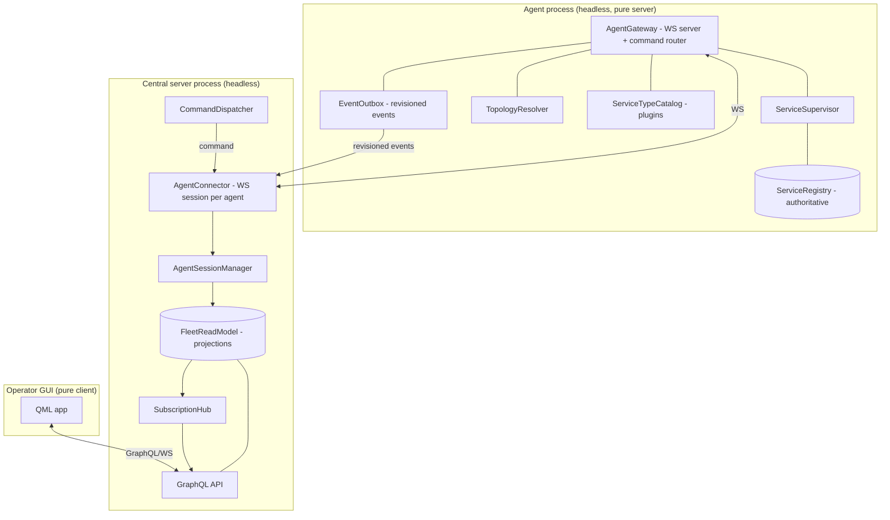

Subsystems and *why they exist*:

| Subsystem | Responsibility | Why it exists |
|---|---|---|
| **ServiceSupervisor** (agent) | Own child processes; drive the service FSM; emit status events. | Replaces polling with supervision; single owner of runtime status. |
| **ServiceRegistry** (agent) | Authoritative store of service descriptors; assign stable ids; bump revision. | Single writer for config; stable identity kills path-matching. |
| **TopologyResolver** (agent) | Compute dependency graph from descriptors; answer topology queries locally. | Preserves the good "agent owns its topology" property, isolated from layout. |
| **ServiceTypeCatalog** (agent) | Load settings plugins once per *type*; expose capability metadata. | Removes per-start reloads; clarifies "plugin." |
| **AgentGateway** (agent) | WS server; authenticate the connector; route commands; expose EventOutbox. | The single, one-directional protocol endpoint. |
| **EventOutbox** (agent) | Buffer revisioned domain events; serve `Resync(sinceRevision)`. | Enables deltas + missed-event recovery without full snapshots. |
| **AgentConnector** (server) | Own the WebSocket session to each enrolled agent (whichever side dialed); heartbeat. | One place owns the socket + liveness. |
| **AgentSessionManager** (server) | One `AgentSession` per agent; session FSM; apply events → projection. | Single owner of "is online" and of applying deltas. |
| **FleetReadModel** (server) | Projections of agents+services+status, each stamped with source revision. | Read model, never a second writer. |
| **CommandDispatcher** (server) | Turn GUI intents into agent commands; correlate responses. | Stateless command path, no nested loops. |
| **SubscriptionHub + GraphQL** (server) | Publish projection deltas to GUIs. | Clean client fan-out. |

### 4.3 Agent architecture

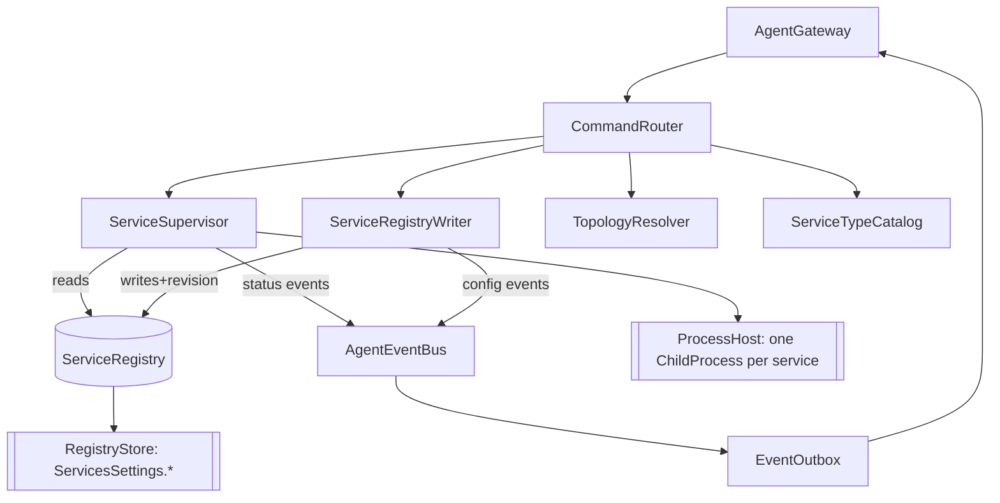

- **Managers:** `ServiceSupervisor` (runtime), `AgentGateway` (transport/session).
- **Registries:** `ServiceRegistry` (config, authoritative, revisioned).
- **Controllers:** `CommandRouter` (stateless dispatch), `TopologyResolver`.
- **Repositories:** `RegistryStore` (persistence adapter — file today, pluggable), `EventOutbox`.
- **Factories:** `ServiceTypeCatalog` (per-type plugin + capability creation), `ChildProcessFactory`.
- **Services (domain):** `ProcessHost` owning one `ChildProcess` per running service.

**Ownership on the agent.** `ServiceRegistry` owns descriptors. `ServiceSupervisor` owns `ChildProcess`
handles and the *current status* (the only status writer). `EventOutbox` owns the revisioned event log.
`AgentGateway` owns the socket/session. Nothing else writes any of these.

### 4.4 Server architecture

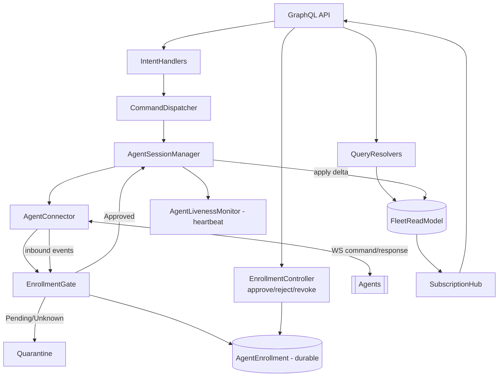

- **Managers:** `AgentSessionManager` (sessions + apply events), `AgentConnector` (sockets), `SubscriptionHub`.
- **Registries:** `AgentEnrollment` (durable identity + approval status of every agent) — the *only* durable
  server store; everything else is a rebuildable projection.
- **Gate:** `EnrollmentGate` authenticates each connection's key and admits it only if `Approved`; otherwise it
  quarantines (Pending) or denies (Rejected/Revoked). See [§4.13](#413-agent-enrollment--approval).
- **Controllers:** `QueryResolvers`, `IntentHandlers`, `CommandDispatcher`, `EnrollmentController` (sole writer
  of `EnrollmentRecord`; approve/reject/revoke/suspend/replaceKey).
- **Repositories:** `FleetReadModel` (in-memory projections; optional snapshot cache), `EnrollmentStore`.
- **Factories:** `AgentSessionFactory`.

**Ownership on the server.** `AgentEnrollment` owns agent identity/config. `AgentSession` owns liveness + the
*applied revision* per agent. `FleetReadModel` owns projections but only `AgentSession` writes them. No
component is both a writer of agent-owned data and a mirror — the write always originates on the agent and is
*applied* (idempotently, by revision) exactly once.

**Deleted outright:** the Lisa/ProLife licensing controllers, `Lisa/graphql`, `ProLife/Views/*` routes, the
Postgres `lisa` dependency, and the embedded-GUI-server packaging.

### 4.5 Wire protocol redesign

> **Transport decision — SETTLED: WebSocket.** The agent↔server link stays on **WebSocket** (JSON frames over a
> single persistent TLS connection). Broker/stream alternatives (NATS JetStream, gRPC bidi) are **explicitly
> deferred** — revisit only under real scale/HA pressure. Everything below is the protocol *on top of* WebSocket;
> it is intentionally transport-shaped (typed envelopes, revisions, resync) so that a future backbone swap, if it
> ever happens, is contained to the transport gateway.

**Roles & dial direction.** One WebSocket per agent carries **commands** (server→agent) and **events**
(agent→server); being bidirectional on a single socket is fine and expected. **Which side *initiates* the
connection is a deployment choice and remains open:** *agent-dials-out* traverses NAT/firewalls (agents on
customer hosts, matches today's behavior); *server-dials-agent* is cleaner by role but requires agents to be
reachable. WebSocket supports either, so the transport decision does not force it. What [P3](#p3--agent-is-both-ws-server-and-ws-client-with-shared-reentrant-handlers) removes is the shared
server-servlet + 100-thread worker-manager + nested event loops — **not** bidirectionality.

**Framing.** Keep JSON-over-WebSocket, but define three explicit envelopes instead of reusing the GQL
subscription plumbing bidirectionally:

```jsonc
// Command (server -> agent), request/response, correlated, idempotent by commandId
{ "type": "cmd", "commandId": "uuid", "name": "StartService",
  "args": { "serviceId": "svc-…" }, "expectRevisionAtLeast": 42 }

// Response (agent -> server)
{ "type": "res", "commandId": "uuid", "ok": true,
  "revision": 43, "result": { … }, "error": null }

// Event (agent -> server), revisioned, ordered per collection
{ "type": "evt", "stream": "services", "revision": 43,
  "kind": "StatusChanged", "payload": { "serviceId": "svc-…", "status": "Running", "observedAt": "…" } }
```

**Versioning.** A `Hello` handshake negotiates `protocolVersion` and returns the agent's current
`{services: rev, topology: rev}`. Breaking changes bump `protocolVersion`; the connector refuses or adapts.

**Heartbeat.** Server sends `Ping` every *N* s; agent replies `Pong{revisions}`. Missing *k* pongs → session
`Suspect` → `Offline`. Liveness is owned solely by `AgentLivenessMonitor` (removes the rest of P4, P6).

**Sync / reconnect.** On connect (or after a gap) the server sends `Resync{ stream, sinceRevision }`; the agent
replies with the **delta** from `EventOutbox`, or a `Snapshot{revision}` if `sinceRevision` is older than the
outbox horizon. No unconditional full pull (removes P6). Events are applied idempotently: `if evt.revision <=
appliedRevision: ignore`.

**Auth / identity.** Per-agent enrollment: the agent presents an enrollment token / public key; no shared
`su/1`/`ClientId=1111`. Secrets never live in `.acc` files (removes P7).

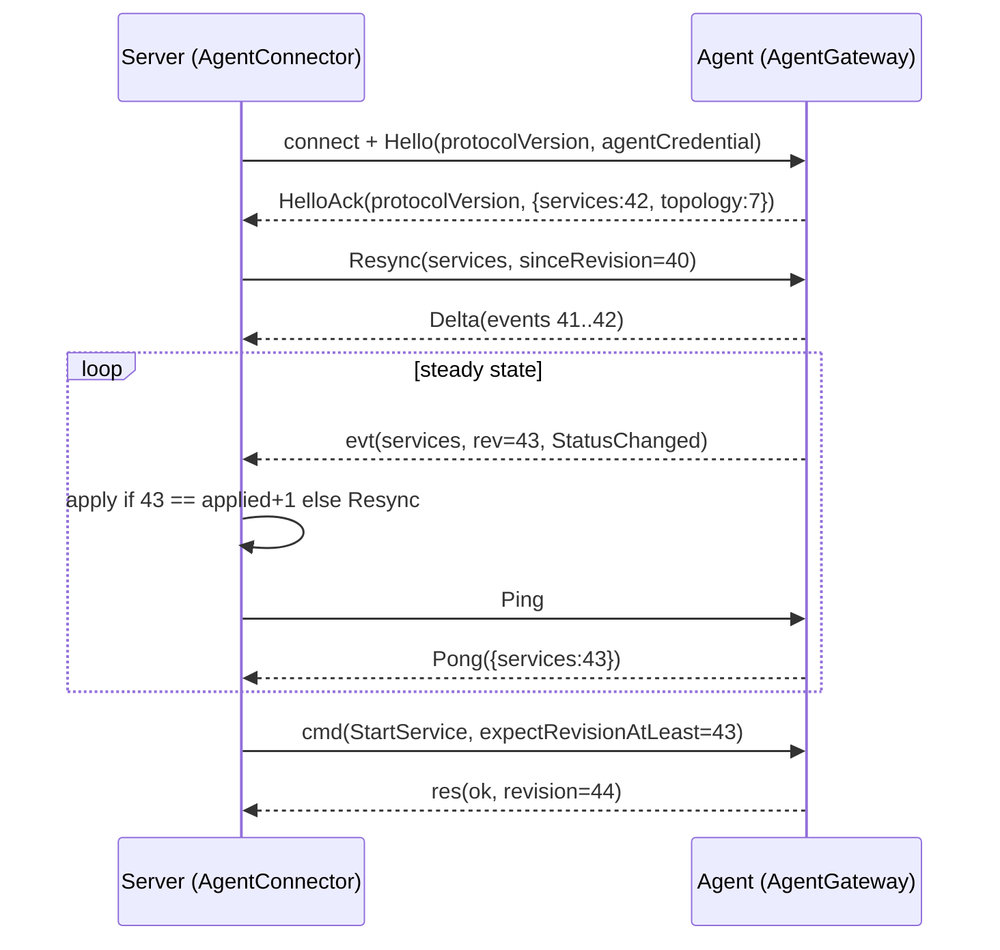

### 4.6 Service lifecycle redesign

Replace the polling monitor with an **event-sourced supervisor** that *owns* a child handle per service. The OS
child object (e.g. a supervised `QProcess` kept alive, or a platform job/cgroup) is the death event source; no
process-table scans, no image-name kills.

Explicit FSM (transition table is normative):

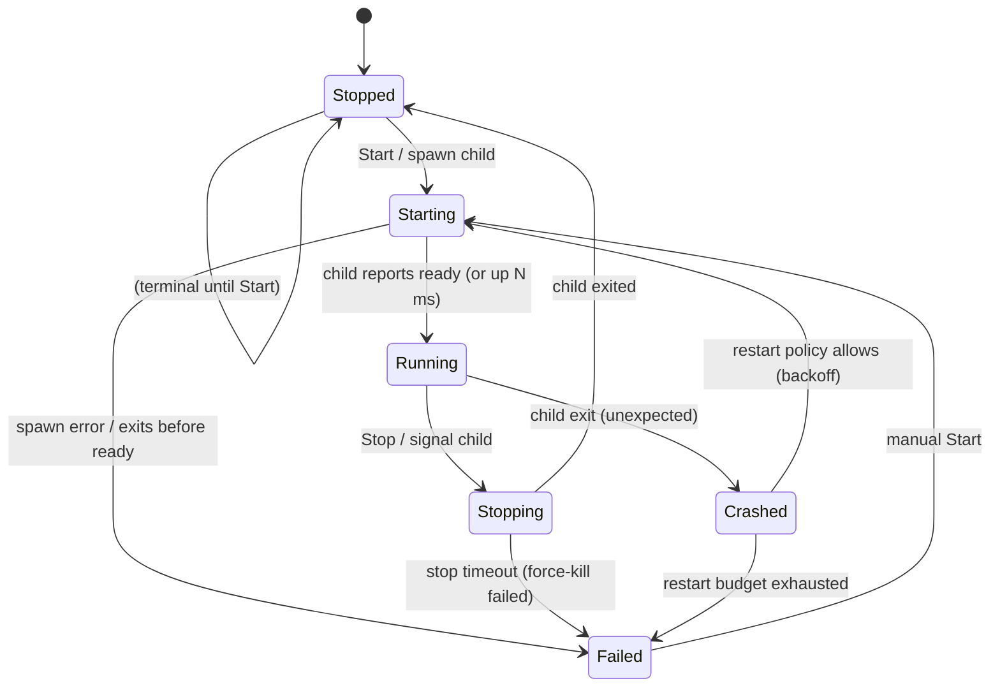

| From | Event | Guard | To | Action |
|---|---|---|---|---|
| Stopped | Start | — | Starting | spawn child, record handle |
| Starting | ChildReady / readyTimeout elapsed with live child | child alive | Running | emit `StatusChanged(Running)` |
| Starting | ChildExited | — | Failed | reason=StartFailed |
| Running | ChildExited | unexpected | Crashed | schedule restart per policy |
| Running | Stop | — | Stopping | signal child (graceful), arm kill timer |
| Stopping | ChildExited | — | Stopped | — |
| Stopping | killTimeout | — | Failed | reason=StopTimeout |
| Crashed | (backoff) | budget>0 | Starting | budget-- |
| Crashed | (backoff) | budget==0 | Failed | reason=CrashLooping |

- **Restart policy** is data (`RestartPolicy{ maxRestarts, window, backoff }`) on the descriptor, not
  hard-coded counters (removes P2/P14 counter soup).
- **`Failed` carries a reason** and is fully serialized (fixes P14).
- **Ownership:** `ServiceSupervisor` is the *only* writer of status; it emits `StatusChanged` to `EventOutbox`
  with a new `revision`. The GUI/server only ever read a projection.

### 4.7 Plugin architecture redesign

Two clearly separated concepts:

1. **Application composition** stays ACF `.acc`/packages — but each shell composes only its own concern
   (agent / server / gui), with the foreign scaffolding deleted.
2. **Service-type plugins** get a first-class registry:

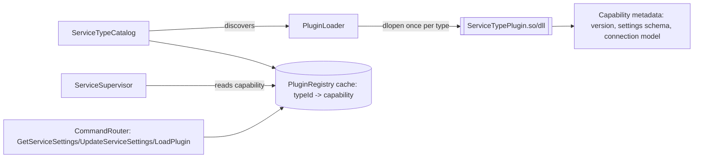

- **PluginLoader:** loads a plugin **once per service type**, not per start (removes P10).
- **PluginDescriptor / Capability:** `{ typeId, version, settingsSchema, connectionModel, capabilities[] }` —
  explicit, queryable metadata; no hidden magic.
- **ServiceTypeCatalog:** maps a descriptor's `typeId` → cached capability; used by the supervisor (version) and
  by settings commands. Loading failures are surfaced as capability status, not silent.

### 4.8 Ownership model

Every important object has exactly one owner, creator, lifetime, and destruction point:

| Object | Owner | Created by | Lifetime | Destroyed at |
|---|---|---|---|---|
| `ServiceDescriptor` | agent `ServiceRegistry` | RegistryWriter (on Add) | until Remove | Remove command |
| `ConnectionEndpoint` (a service's exposed input) | agent `ServiceRegistry` (part of the producer descriptor) | plugin schema + registry | with the producer service | producer Remove |
| `ConnectionBinding` (a consumer's output→endpoint) | agent `ServiceRegistry` (part of the *consumer* descriptor) | editor via server, or agent locally | with the consumer service | rebind / consumer Remove |
| `ConnectionEndpointCatalog` (fleet-wide) | server `FleetReadModel` | applied by `AgentSession` from producer events | while any producer enrolled | evict on unenroll |
| `ChildProcess` handle | agent `ServiceSupervisor` | ChildProcessFactory (on Start) | Running/Stopping | child exit / Stop |
| current `RuntimeState` | agent `ServiceSupervisor` | supervisor | process-lifetime | overwritten per transition |
| event log entries | agent `EventOutbox` | domain producers | until outbox horizon | horizon trim |
| `PluginCapability` | agent `ServiceTypeCatalog` | PluginLoader | until type unused | catalog eviction |
| `EnrollmentRecord` (identity + approval status) | server `AgentEnrollment` store; **sole writer** `EnrollmentController` | first authenticated connect (Pending) / admin action | durable, until unenroll | Unenroll |
| `AgentSession` | server `AgentSessionManager` | AgentSessionFactory on connect | connection-lifetime | disconnect |
| projection rows | server `FleetReadModel` | applied by `AgentSession` | while agent enrolled | unenroll / evict |
| topology layout (x/y) | GUI client | GUI | user session | client-side only |

No object is owned by two components; no component both mirrors and writes upstream data.

### 4.9 Data model — configuration vs. runtime state

Cleanly separated: **descriptors** (config, agent-owned, persisted) vs. **runtime state** (supervisor-owned,
ephemeral) vs. **projections** (server read model).

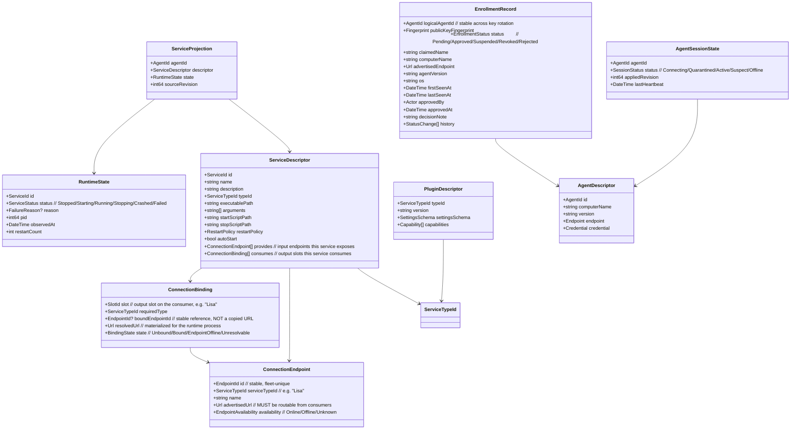

Key differences from today:
- **Status is a field of runtime state**, not a separate collection (kills P1/P13).
- **Projections carry `sourceRevision`** so apply is idempotent and ordered (kills P6 races).
- **Topology layout is not in this model** — it is client-only (kills P11).
- **Identity is a stable `ServiceId`**, never the executable path (kills P9 path-matching).
- **Connection points are typed and plugin-declared**; a binding references a stable `EndpointId`, not a copied
  URL, and carries an explicit `BindingState` (kills P15). See [§4.12](#412-service-connections--cross-agent-wiring).

### 4.10 Event flows

**Agent → Server (status change).**
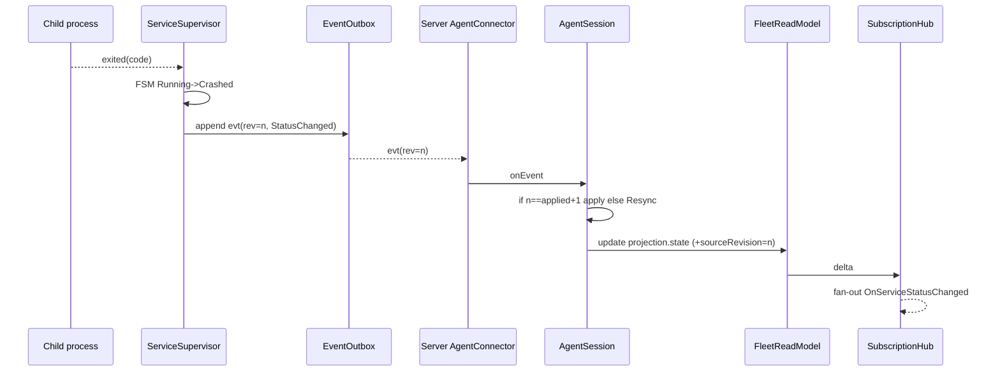

**Server → Agent (operator intent).**
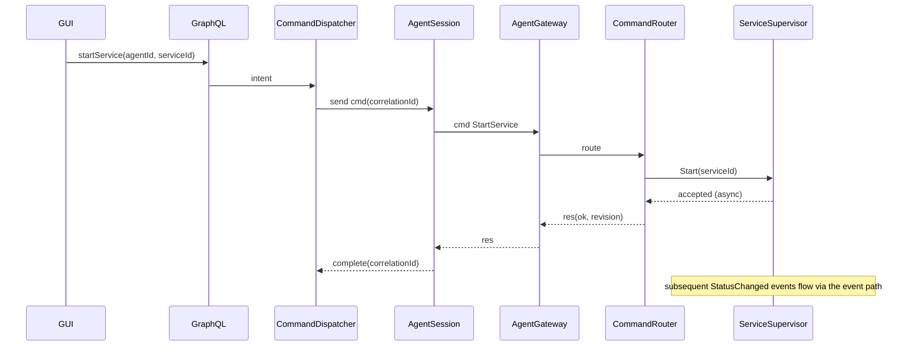

**Plugin → ServiceType, Service → Registry, Registry → projection, Projection → UI** all follow the same
one-directional shape: producer owns the fact → emits a revisioned event → single applier updates the read
model → hub notifies. There is exactly one applier per stream.

### 4.11 Dependency graph

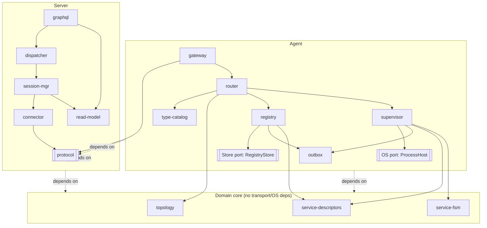

Rules enforced: domain core depends on nothing but itself; OS and storage are **ports** behind interfaces
(dependency inversion); no cycles; transport (`protocol`) is a leaf shared by both sides; the GUI depends only
on the GraphQL surface.

### 4.12 Service connections & cross-agent wiring

This section makes the connection domain ([§2.8](#28-service-connections--cross-agent-wiring-as-built)) a
first-class citizen of the target design, honoring three hard constraints:

1. **A service's connection points are declared by its plugin** (typed input/output, by service type).
2. **The editor picks a target from a fleet-wide list** that may span many agents (N Lisas on N agents).
3. **Agents must stay mutually ignorant.** Cross-agent binding is orchestrated centrally and materializes on
   the consumer as a plain, routable endpoint URL that its *process* dials directly. Same-agent binding can be
   done by the agent alone.

**Concepts.**

| Concept | Owner | What it is |
|---|---|---|
| **ConnectionEndpoint** | producer's agent (part of its descriptor) | A typed input a service exposes (`serviceTypeId`, stable `EndpointId`, `advertisedUrl`, availability). Declared by the plugin schema, addressed by the registry. |
| **ConnectionBinding** | consumer's agent (part of its descriptor) | A consumer output *slot* bound to an `EndpointId`, plus the materialized `resolvedUrl` its process uses, plus a `BindingState`. |
| **ServiceTypeCatalog** | agent | Declares which slots/endpoints a service *type* has (so the editor knows ProLife has a "Lisa" slot before any instance exists). |
| **ConnectionEndpointCatalog** | server `FleetReadModel` | Fleet-wide, **indexed by service type**, projection of every agent's endpoints — the editor's pick-list source. Replaces the O(fleet) linear scan. |
| **BindingResolver** | server | Turns "bind consumer slot → EndpointId" into a `resolvedUrl` and issues a command to the consumer's agent. |
| **BindingPropagator** | server | On a producer endpoint URL/availability change, finds affected bindings via a reverse index (`EndpointId → bindings`) and re-materializes them on each consumer's agent. |

**Why the binding lives in the consumer's descriptor (not the server).** The ProLife *process* is what actually
connects to Lisa; it reads its own descriptor on its own agent. So the binding's materialized URL must be
agent-local to the consumer. The server owns only the **catalog** (choices) and the **resolution/propagation**
(turning a logical `EndpointId` into a URL and keeping it fresh). This is what keeps agents mutually ignorant:
an agent stores a URL, never a reference to another agent.

**Stable identity, not copied URLs.** A binding references a **fleet-stable `EndpointId`** (assigned once when a
producer endpoint is first seen and preserved across restarts/moves), not a snapshot of the URL. Re-materializing
the URL is always derivable from the catalog, so a producer that moves hosts does not silently break consumers —
the propagator refreshes them and, if the producer is offline, sets `BindingState = EndpointOffline` instead of
leaving a stale address with no signal. (Kills P15.)

**Same-agent (local) binding.** When both services are on one agent, `BindingResolver`'s job is done by the
agent itself: it already holds both descriptors, so `CommandRouter.Bind(consumerSlot, localEndpointId)` resolves
the URL locally and bumps the consumer's revision. The resulting descriptor is identical in shape to a
server-resolved one — the only difference is *who* resolved it. No server round-trip is required.

**Routability.** An endpoint's `advertisedUrl` must be reachable from consumers, not a loopback default. The
producer's agent advertises a routable address (configurable per agent: its externally reachable host); the
catalog rejects/flags loopback endpoints for cross-agent use while still allowing them for same-agent bindings.

**Cross-agent binding flow.**

```mermaid
sequenceDiagram
    participant ED as Editor (GUI)
    participant GQL as Server GraphQL
    participant CAT as ConnectionEndpointCatalog
    participant RES as BindingResolver
    participant SESSc as AgentSession (consumer = Agent A)
    participant GWc as Agent A Gateway
    participant REGc as Agent A Registry
    participant PROC as ProLife process

    ED->>GQL: listEndpoints(serviceType = "Lisa")
    GQL->>CAT: query by type (indexed)
    CAT-->>ED: [Lisa#1@AgentB, Lisa#2@AgentC]  (fleet-wide)
    ED->>GQL: bind(ProLife@AgentA, slot="Lisa", endpointId = Lisa#1)
    GQL->>RES: resolve(endpointId Lisa#1)
    RES->>CAT: advertisedUrl(Lisa#1) = hostB:7001
    RES->>SESSc: cmd Bind(serviceId=ProLife, slot="Lisa", endpointId, resolvedUrl=hostB:7001)
    SESSc->>GWc: cmd
    GWc->>REGc: set consumes[Lisa] = {endpointId, hostB:7001, Bound}; revision++
    REGc-->>GWc: evt(services, rev, BindingChanged)
    Note over PROC: on (re)start ProLife reads its descriptor and dials hostB:7001 directly
```

**Producer URL/availability change → fan-out.**

```mermaid
sequenceDiagram
    participant SESSp as AgentSession (producer = Agent B)
    participant CAT as ConnectionEndpointCatalog
    participant PROP as BindingPropagator
    participant SESSc as AgentSession (consumer = Agent A)
    participant REGc as Agent A Registry
    SESSp->>CAT: apply evt EndpointChanged(Lisa#1, url=hostB:7002)
    CAT->>PROP: endpoint Lisa#1 changed
    PROP->>PROP: reverse index EndpointId -> [ProLife@AgentA, ...]
    PROP->>SESSc: cmd Rebind(ProLife, slot="Lisa", resolvedUrl=hostB:7002)
    SESSc->>REGc: update consumes[Lisa].resolvedUrl; revision++
    Note over PROP,REGc: if producer offline -> set BindingState = EndpointOffline (no stale silent URL)
```

**How this fits the invariants.** Endpoints and bindings are ordinary descriptor fields, so they flow through
the *same* one-directional, revisioned event stream as everything else — no new sync channel. The server never
becomes a second writer of a binding; it only issues commands that the consumer's agent applies (bumping *its*
revision). The catalog is a pure projection, indexed for O(log n)/O(1) lookups instead of O(fleet) scans.

### 4.13 Agent enrollment & approval

Today an agent auto-joins the fleet the instant it connects ([P16](#p16--agents-auto-join-with-no-admin-approval-and-no-per-agent-identity)). The target design gates that behind an
explicit admin decision: **connect → `Pending` → approve → full operation.** The critical insight is that this
is a *second, durable state machine* — **enrollment** — that is **orthogonal** to the ephemeral **session /
liveness** FSM. An agent can be `Approved` + `Offline`, or `Pending` + `Connected`. Conflating the two is what
made the current system trust-on-connect.

**Identity model (foundation — also closes [P7](#p7--hard-coded-credentials-and-shared-client-id)/[P16](#p16--agents-auto-join-with-no-admin-approval-and-no-per-agent-identity)).**
- Each agent generates a keypair on first run. **`agentId = fingerprint(publicKey)`.** Every frame is
  authenticated by that key (mTLS client certificate, or an application-level signed session). **No shared
  secrets, no `su/1`, no `ClientId=1111`.**
- On connect the server issues a **nonce challenge**; the agent signs it, proving possession of the private key.
  This prevents fingerprint spoofing and replay — a host cannot claim another agent's identity without its key.
- The fingerprint is printed by the agent (console / installer / local GUI) so an admin can verify it
  **out-of-band** before approving — defeating a man-in-the-middle at enrollment time.

**Two orthogonal state machines.**

| FSM | Scope | Persistence | States |
|---|---|---|---|
| **EnrollmentStatus** | per `agentId` | durable (`AgentEnrollment` store) | `Unknown → Pending → Approved → {Suspended, Revoked, Rejected}` |
| **SessionStatus** | per connection | ephemeral | `Connecting → Quarantined \| Active → Suspect → Offline` |

The **Pending list** the operator sees is exactly `{ agentId : EnrollmentStatus == Pending }`. Because
enrollment is durable, a pending entry survives disconnects — an admin can approve an agent that has since gone
away, and the decision applies on its next connect.

```mermaid
stateDiagram-v2
    [*] --> Unknown
    Unknown --> Pending: first authenticated connect (create record)
    Pending --> Approved: admin Approve
    Pending --> Rejected: admin Reject
    Approved --> Suspended: admin Suspend (temporary)
    Suspended --> Approved: admin Resume
    Approved --> Revoked: admin Revoke (evict + drop endpoints)
    Rejected --> Pending: admin Reset
    Rejected --> Approved: admin override
    Revoked --> Approved: admin re-approve (with warning + history)
    Approved --> [*]: Unenroll
    Rejected --> [*]: Unenroll
    Revoked --> [*]: Unenroll
```

**Quarantine — what an un-approved connection may do.** While `EnrollmentStatus ∈ {Unknown, Pending}` the
session is **Quarantined**. It may only:
- send **`Hello`** (identity proof + attributes: `computerName`, `agentVersion`, `os`, `advertisedEndpoint`,
  optional `claimedName` / enrollment note),
- exchange **heartbeats**, and
- **receive its own approval status** (so it can show "waiting for approval" locally and back off).

The server ingests **zero domain data** from a quarantined agent: no service collection, **no endpoints in the
`ConnectionEndpointCatalog`**, no command routing, no topology. Quarantined connections are rate-limited.
**A `Pending` record persists indefinitely** (no auto-expiry) — it stays in the approvals list until an admin
decides, so nothing is silently dropped; unbounded growth is a non-issue because a rejected key is closed on
sight (below) and never re-enters the list.

**Approval decision surface.** To make a sound decision the admin sees: **fingerprint** (for out-of-band
check), `computerName`, `advertisedEndpoint` / source IP, `agentVersion`, `os`, `firstSeenAt` / `lastSeenAt`,
`claimedName` / note, and **prior history** (e.g. "was `Revoked` on …") so a re-appearing rejected/revoked key
is obvious.

**Transitions & their effects.**
- **Approve:** persist `{status=Approved, approvedBy, approvedAt}` → session `Quarantined → Active` → server runs
  `Resync` (pulls the agent's revisions) → the agent's endpoints enter the catalog → it becomes a full
  participant. The agent is notified and stops backing off.
- **Reject:** persist `Rejected` → **close the socket immediately.** The agent may try again later; every
  subsequent connect is authenticated, matched to the `Rejected` record, and the socket is **closed again at the
  gate** — it never re-enters the pending list — until an admin `Reset`s it.
- **Revoke** (was `Approved`): **immediate** — evict the agent's projections, remove its endpoints from the
  catalog, set dependent consumer bindings to `EndpointOffline` / `Unresolvable`
  ([§4.12](#412-service-connections--cross-agent-wiring)), and close the session. History of the prior approval
  is retained.
- **Suspend / Resume:** temporarily disable an approved agent without losing its approval.

**Trust policies (configurable; default = Manual).** Manual approval is the default and the requirement, but the
gate is policy-driven so it can scale:
- **Manual** — admin approves each agent (default).
- **Enrollment token** — the agent presents a one-time, admin-issued, short-lived token → auto-approve
  (zero-touch provisioning), still fully recorded and revocable.
- **Fingerprint allowlist** — pre-seeded approved fingerprints for infrastructure-as-code deployments.

**Key rotation / re-enrollment (resolves the parked `EndpointId` question).** A reinstalled host produces a new
keypair → new fingerprint → a new `Pending` entry; the old record stays `Approved + Offline`. The admin can
**Replace key**: bind the new fingerprint to the existing **logical agent**, transferring its history and its
**stable logical `agentId`**. Deriving `EndpointId` from the *logical* agentId (not the key fingerprint) then
means endpoint bindings survive a host reinstall — which is precisely the stability property left open in
[§4.12](#412-service-connections--cross-agent-wiring).

**Placement & ownership.** An **`EnrollmentGate`** sits in front of `AgentSessionManager`: authenticate key →
look up `EnrollmentStatus` → `Approved ⇒ Active` session; `Pending`/`Unknown ⇒` quarantine + upsert the pending
record; `Rejected`/`Revoked ⇒` deny. The `EnrollmentRecord` is owned by the durable **`AgentEnrollment`** store,
with **`EnrollmentController` as the sole writer** (admin actions + first-connect). Admin API:
`listPendingAgents`, `listAgents(status)`, `approveAgent(agentId, name?, note?)`, `rejectAgent`, `revokeAgent`,
`suspend`/`resume`, `replaceKey(logicalAgentId, newFingerprint)`. `SubscriptionHub` pushes pending-list deltas
so the approvals UI updates live.

**Approving authority.** The built-in server **`su`** account is the root approver — it can approve / reject /
revoke agents out of the box, so there is no chicken-and-egg at first deployment. (A finer-grained
authorization model — which roles may approve — is deliberately out of scope here and layered on later; it does
not change the enrollment mechanics.)

```mermaid
sequenceDiagram
    participant A as Agent
    participant GATE as EnrollmentGate
    participant ENR as AgentEnrollment (durable)
    participant ADMIN as Operator (GUI)
    participant SESS as AgentSessionManager
    participant CAT as ConnectionEndpointCatalog

    A->>GATE: connect + Hello(publicKey, attrs)
    GATE->>A: nonce challenge
    A-->>GATE: signed(nonce)  // proves key possession
    GATE->>ENR: lookup(agentId = fingerprint)
    alt Unknown or Pending
        GATE->>ENR: upsert Pending(attrs, lastSeen)
        GATE->>A: status = Pending (quarantined)
        ENR-->>ADMIN: pending-list delta (live)
        Note over A,SESS: no data ingested, no commands routed
        ADMIN->>ENR: approveAgent(agentId, name, note)
        ENR->>SESS: activate(agentId)
        SESS->>A: status = Approved
        SESS->>A: Resync(sinceRevision)
        A-->>SESS: delta (services, endpoints)
        SESS->>CAT: register agent endpoints
    else Approved
        GATE->>SESS: activate (straight to Active)
    else Rejected or Revoked
        GATE->>A: deny + close
    end
```

**Why this is the ideal shape.** Trust is a durable, audited, per-key decision — not a side effect of opening a
socket. The quarantine guarantees an un-approved agent can neither pollute the fleet's data nor be chosen as a
connection target. Revocation is immediate and cascades correctly into the connection model. And because
enrollment is orthogonal to liveness, the approval workflow is unaffected by flapping connections. This closes
[P7](#p7--hard-coded-credentials-and-shared-client-id) and [P16](#p16--agents-auto-join-with-no-admin-approval-and-no-per-agent-identity) and provides the stable logical identity the rest of the model ([§4.9](#49-data-model)/[§4.12](#412-service-connections--cross-agent-wiring)) needs.

### 4.14 Composition & ACC file structure

The ACF composition (`.acc` registries + `.arp`/`Pck`/`Voce` packages) is **not** an implementation detail — it
is the *physical manifestation* of the architecture. If the module boundaries, ownership, and dependency
inversion from this document are not visible in the registry structure, they don't really exist. Today the
composition is where the architecture is at its worst
([§2.7](#27-structural-diagrams)/[P5](#p5--overloaded-god-components-agentrepository-cagentinfo-cservicecontrollercomp)/[P8](#p8--copy-pasted-foreign-product-scaffolding-in-the-server-composite)):
`Server.acc` carries Lisa/ProLife scaffolding, `Pages.acc` wires one `AgentRepository` as `AgentCollection` +
`ObjectCollection` + `ServiceManager` at once, `AgentServer.acc` bakes in `su`/`1`/`ClientId=1111`,
`AgentSubscribers.acc` duplicates subscriber lists across the WS server and client, and there are typo'd
component ids (`WorkerManaqer`, `CommandsDataCoontrollers`). The new architecture must be composed as cleanly as
it is designed.

**Rules for the `.acc` composition.**
1. **One component = one role.** Every `I_REF` points at a component that registers *exactly* the interface it
   needs. No more `AgentRepository` triple-hat: `ServiceRegistry`, the mirror/read-model, and the service
   manager are distinct components with distinct exported interfaces.
2. **One composite (embedded registry / `Voce`) per subsystem,** named after it, exposing a **minimal**
   `ExportedInterfaces` / `ExportedComponents` surface. Export only what other subsystems legitimately consume —
   the export list *is* the module's public API. Everything else stays private inside the registry.
3. **Strict package layering.** Leaf components live in `…Pck` packages; wired composites live in `…Voce`
   packages / `.arp` folders; the **app `.acc` is thin** — it wires only top-level subsystems + app config and
   names them in `ComponentsToInitialize`, never deep internals.
4. **No secrets or environment literals in `.acc`.** Credentials, DB passwords, tokens, and per-deployment
   endpoints/ports move to config / the enrollment store / a secret provider referenced by the composition —
   never a literal `Value="…"`. (Removes `su`/`1`/`ClientId=1111`, DB password `12345`.)
5. **No foreign-product components.** Delete every Lisa/ProLife element (Account/Product/Installation/Feature
   controllers, `Lisa/graphql`, `ProLife/Views/*`, the Postgres `lisa` engine) from the Agentino composites.
6. **No duplicated wiring.** The agent's two subscriber arrays (WS server + WS client) collapse to the single
   typed-protocol endpoint ([§4.5](#45-wire-protocol-redesign)); each subscriber/handler is declared once.
7. **Names are the contract.** `ComponentId`s match their C++ role names; registry ids match subsystem names;
   fix typos (`WorkerManaqer` → `WorkerManager`, `CommandsDataCoontrollers` → `CommandsDataControllers`). A
   reader must be able to map an `.acc` element to a design component by name alone.
8. **Fail at load, not at runtime.** Mandatory dependencies are declared required (`I_ASSIGN(..., true, ...)`)
   so a mis-wired registry is rejected when the container builds it, not via a runtime `Q_ASSERT` later.
9. **Attribute hygiene.** No dead attribute stubs beyond what export/override actually needs; group related
   wiring and add a short comment for any non-obvious reference (the codebase already does this well in places —
   make it the norm).

**Target composite layout** (mirrors [§4.3](#43-agent-architecture)/[§4.4](#44-server-architecture); illustrative
package ids):

```text
AgentinoAgent.acc            (thin app shell: config + ComponentsToInitialize)
└─ AgentRuntime              [AgentinoAgentVoce::AgentRuntime]   composite
   ├─ ServiceRegistry        [AgentinoDataPck]     authoritative descriptors, revisioned
   ├─ ServiceSupervisor      [AgentinoDataPck]     owns child processes + FSM (event-sourced)
   ├─ TopologyResolver       [AgentinoDataPck]
   ├─ ServiceTypeCatalog     [AgentinoDataPck]     plugin loader/cache (once per type)
   ├─ EventOutbox            [AgentGqlPck]         revisioned events + Resync
   ├─ AgentGateway           [AgentGqlPck]         single WS endpoint + command router
   ├─ RegistryStore          [ImtCoreVoce]         ServicesSettings.* persistence
   └─ AgentIdentity          [ImtAuthVoce]         keypair (no literal credentials)

AgentinoServer.acc           (thin app shell, headless)
└─ ServerCore                [AgentinoVoce::ServerCore]          composite
   ├─ AgentEnrollment        [AgentinoGqlPck]      durable identity + approval (only durable store)
   ├─ EnrollmentGate         [AgentinoGqlPck]      admits Approved / quarantines Pending / denies
   ├─ EnrollmentController   [AgentinoGqlPck]      sole writer of EnrollmentRecord
   ├─ AgentConnector         [ImtClientGqlPck]     WS session per agent
   ├─ AgentSessionManager    [AgentinoGqlPck]      applies revisioned deltas (single applier)
   ├─ FleetReadModel         [AgentinoGqlPck]      projections (rebuildable)
   ├─ ConnectionCatalog      [AgentinoGqlPck]      endpoint catalog + BindingResolver/Propagator
   ├─ CommandDispatcher      [AgentinoGqlPck]      stateless intent → agent command
   ├─ SubscriptionHub        [ImtServerGqlPck]     fan-out to GUIs
   └─ GraphQLApi             [ImtGraphQlVoce]      agents/services/topology/connections/enrollment

AgentinoServerGui.acc        (pure client shell; QML composition root → §6.5)
```

**Deletion list (composition).** `Server.acc` licensing controllers + `PgSqlDatabaseEngine(lisa)`;
`Handlers.acc` `Lisa/graphql` + `ProLife/Views/*`; `AgentServer.acc` embedded `WebSocketClient` servlet/worker
stack + hard-coded credentials; the duplicated subscriber arrays in `AgentSubscribers.acc`; the
`AgentRepository` multi-role wiring in `Pages.acc`.

**ACC definition of done.** Each design subsystem maps to exactly one named composite; every `I_REF` resolves to
a component registering that one interface; no secret/DB literal appears in any `.acc`; no Lisa/ProLife element
remains; the app `.acc`s are thin; component ids are typo-free and match design names; and a new engineer can
reconstruct the [§4.2](#42-subsystem-overview) diagram from the registry structure alone.

> **Process note.** ACC composition is not a separate phase — each roadmap step ([§5](#5-migration-roadmap))
> lands its own `.acc` changes under these rules, and Step 0 already removes the foreign scaffolding. This
> section is the standard those per-step edits are held to.

---

## 5. Migration roadmap

Backward compatibility is not required, so the roadmap optimizes for *reaching the clean model fast while
keeping something runnable*. Each step is independently validatable.

### Step 0 — Delete foreign scaffolding (fast win, de-risks everything)
- **Objective.** Remove Lisa/ProLife licensing surface and the Postgres `lisa` dependency from the server.
- **Affected.** `Partitura/AgentinoVoce.arp/Server.acc`, `Handlers.acc`.
- **Remove.** Account/Product/Installation/Feature controllers & repositories; `Lisa/graphql`,
  `ProLife/Views/*` routes; `PgSqlDatabaseEngine` (`lisa`, hard-coded pw); `PreferencesQml`/`ProLifeVoce` refs.
- **Create.** A trimmed `AgentinoServer` GQL route set (agents/services/topology/auth only).
- **Risks.** Hidden references from QML pages; auth wiring coupling.
- **Validation.** Server boots; GraphQL exposes only Agentino commands; no Postgres required.

### Step 1 — Introduce the protocol module + `Hello`/heartbeat (no behavior change yet)
- **Objective.** Add `protocol` (envelopes, versioning, ping/pong) alongside the existing channel.
- **Affected.** New `agentproto` lib; `AgentGateway` shim on agent; `AgentConnector` shim on server.
- **Create.** `Command/Response/Event` envelopes; `HelloHandshake`; `Heartbeat`.
- **Remove.** Nothing yet.
- **Risks.** Running two channels transiently.
- **Validation.** Handshake + heartbeat drive an explicit `AgentSession` FSM; offline detected by missed pongs
  (not the 500 ms reconcile timer).

### Step 2 — Collapse the dual server+client link into one disciplined WebSocket protocol
- **Objective.** Keep **WebSocket** (settled) but stop reusing the full server servlet stack bidirectionally:
  one link per agent carrying typed `cmd/res/evt` ([§4.5](#45-wire-protocol-redesign)) instead of
  GQL-subscriptions-as-bus. *Dial direction stays open* — default to keeping **agent-dials-out** (NAT-friendly,
  matches today) unless a deployment decision says otherwise.
- **Affected.** `AgentServer.acc` (the `WebSocketClient` embedded registry with `WebSocketServlet` +
  `WorkerManager`, `ServiceManagerSubscriptionClient`, `AgentServiceCollectionSyncClient`, upstream subscribers);
  server `AgentConnector`.
- **Remove.** The shared bidirectional `WebSocketServlet` + 100-thread `WorkerManager` on the agent link;
  GQL-subscription-as-notification-bus; the nested-event-loop request path; hard-coded `su/1`/`1111`.
- **Create.** Single typed-protocol endpoint per side; per-agent enrollment credential; connector auth.
- **Risks.** Reworking auth/identity; if *server-dials-agent* is later chosen, agent reachability/NAT.
- **Validation.** Exactly one link per agent; no nested-event-loop workarounds remain; kill a service on the
  agent and see one event reach the server with a monotonically increasing revision; no `m_agentsBeingReconciled`
  guard needed.

### Step 2b — Enrollment & approval gate
- **Objective.** Replace auto-join with `Pending → approve → Active`; introduce per-agent key identity.
- **Affected.** New `AgentEnrollment` store + `EnrollmentGate` + `EnrollmentController` on the server; agent
  keypair generation + `Hello`/challenge; admin GraphQL + approvals UI.
- **Remove.** Hard-coded `su`/`1`/`ClientId=1111`; implicit trust-on-connect.
- **Create.** `agentId = fingerprint(publicKey)`, nonce challenge, enrollment FSM
  (`Pending/Approved/Suspended/Revoked/Rejected`), quarantine (zero data ingestion), trust policies
  (manual default / token / allowlist), `replaceKey` for host reinstalls, live pending-list subscription.
  Root approver is the built-in `su` account (no separate bootstrap).
- **Risks.** Key storage/rotation on the agent; out-of-band fingerprint UX.
- **Validation.** A fresh agent shows up as `Pending` and ingests nothing; after approve it resyncs and appears
  in catalogs; revoke evicts it and flips dependent bindings to `EndpointOffline`; a rejected key does not
  re-spam the pending list; a reinstalled host can be `replaceKey`d without losing bindings.
- **Depends on.** Step 2 (one-directional, key-authenticated link).

### Step 3 — Event-sourced supervisor + explicit FSM on the agent
- **Objective.** Replace `CServiceControllerComp` polling/scan/kill with `ServiceSupervisor` owning child
  handles.
- **Affected.** `agentinodata` (new `service-fsm`, `ServiceSupervisor`, `ProcessHost`).
- **Remove.** 5 s poll, process-table scans, `system("taskkill/pkill")` image-name fallbacks, counter FSM.
- **Create.** `RestartPolicy`, `Failed{reason}`, `ChildProcess` ownership, `EventOutbox`.
- **Risks.** Platform child-supervision differences (Win job objects / POSIX process groups); services started
  via scripts that re-exec.
- **Validation.** Crash a service → `Crashed`→restart(backoff)→`Running` with correct events, sub-second
  latency, and *no* unrelated same-image processes affected.

### Step 4 — Collapse server state into one read model
- **Objective.** Replace the nested per-agent mirror + `ServiceStatusCollection` with `FleetReadModel`
  projections stamped by revision; single applier in `AgentSession`.
- **Affected.** `agentinogql` (`CSubscriptionControllerComp`, `CServiceControllerProxyComp`,
  `CServerServiceCollectionControllerComp`, `CTopologyControllerComp`), `CAgentInfo`.
- **Remove.** `CAgentInfo`'s embedded `TModelWrap`/nested collection; `IServiceCollectionSynchronizer`'s
  full-pull path; `RemoveStaleMirrorServicesByPath`; the three-way sync mechanisms; `AgentRepository` triple
  role.
- **Create.** `ServiceProjection` with `sourceRevision`; idempotent apply; `Resync(sinceRevision)` delta.
- **Risks.** GraphQL resolvers assume the old collection shapes; QML bindings.
- **Validation.** One writer per fact (assert in tests); reconnect transfers a delta, not a full snapshot;
  status/identity races gone.

### Step 5 — Plugin registry + type catalog
- **Objective.** Load service-type plugins once per type; cache capabilities.
- **Affected.** `CServiceControllerComp::UpdateServiceVersion` path → `ServiceTypeCatalog`/`PluginLoader`.
- **Remove.** Per-start `PluginManager` creation.
- **Create.** `PluginDescriptor`, `PluginRegistry` cache, capability-based `GetServiceSettings`.
- **Risks.** Plugin ABI assumptions; version-read timing.
- **Validation.** A service start does zero dlopen after first load of its type; settings/version served from
  cache.

### Step 5b — Connection endpoint catalog + binding resolver/propagator
- **Objective.** Replace fleet-wide linear-scan connection resolution with an indexed catalog and stable
  `EndpointId` bindings.
- **Affected.** `CServiceControllerProxyComp` connection methods (`GetConnectionsModel`,
  `GetDependantServerConnectionParam`, `GetServiceIdsByDependantId`, `OnUpdateConnectionUrl`,
  `UpdateConnectionForService`); `IServiceInfo` connection collections; editor QML.
- **Remove.** Per-query scans over `AgentCollection × services × connections`; URL-copy bindings.
- **Create.** `ConnectionEndpointCatalog` (indexed by service type, with reverse `EndpointId → bindings`
  index), `BindingResolver`, `BindingPropagator`, `EndpointId` assignment, `BindingState`
  (`Bound/EndpointOffline/Unresolvable`), routable-address validation, and the agent-local `Bind` path for
  same-agent wiring.
- **Risks.** Existing bindings reference raw ids/URLs — need a one-time migration to assign `EndpointId`s;
  agents must be configured with a routable advertised host.
- **Validation.** Editor pick-list is O(1)/O(log n) by type; moving a producer host rebinds consumers
  automatically; an offline producer yields `EndpointOffline` (not a stale silent URL); same-agent binding
  needs no server round-trip; cross-agent binding never introduces an agent→agent channel.
- **Depends on.** Steps 1–4 (revisions + one-directional events + one read model).

### Step 6 — Split shells; headless server; pure-client GUI
- **Objective.** Stop embedding the server in the GUI process.
- **Affected.** `AgentinoClientServer.acc`, `AgentinoServer.acc`, GUI composition.
- **Remove.** `ComponentsToInitialize` server bootstrapping inside the GUI shell.
- **Create.** Standalone headless `AgentinoServer`; GUI talks GraphQL to it (or directly to an agent for the
  single-agent case).
- **Risks.** Deployment/packaging changes; local dev ergonomics.
- **Validation.** Server runs headless; GUI attaches/detaches without affecting agent I/O; a GUI stall never
  stalls agent event processing.

### Step 7 — Topology as a client concern
- **Objective.** Remove layout (x/y) from the domain/sync plane.
- **Affected.** `TopologyCollection` handling; `CTopologyControllerComp`; QML.
- **Remove.** Server-side topology *layout* storage from the sync path (keep dependency-graph resolution).
- **Create.** Client-side layout store keyed by `serviceId`.
- **Risks.** Existing saved layouts; multi-user layout expectations.
- **Validation.** Domain events never carry x/y; layout survives independent of agent sync.

### Sequencing & parallelism
- Step 0 is independent and should land first.
- Steps 1→2→3 are the critical path (protocol → direction → supervision).
- Step 4 depends on 1–3 (needs revisions + one-directional events).
- Steps 5, 6, 7 can proceed in parallel once 1–4 land.

### Definition of done (architecture-level acceptance)
- Exactly one writer per fact; a test asserts no component both mirrors and writes upstream data.
- No polling of the OS process table; status latency < 1 s on crash.
- One socket, one direction; no nested event loops, no re-entrancy guards, no thread-hop workarounds in the
  hot path.
- Reconnect transfers a bounded delta; heartbeat-based liveness.
- No secrets in composition files; per-agent identity.
- No Lisa/ProLife symbols, routes, or Postgres dependency remain.
- **ACC composition is clean** ([§4.14](#414-composition--acc-file-structure)): one named composite per
  subsystem, one role per component, thin app `.acc`s, typo-free ids, minimal export surfaces.

---

## 6. GUI (QML) architecture & improvement plan

The GUI must satisfy the same principles as the backend: **clean layering, reusable components, and a
transport layer abstracted behind ports** so that moving off GraphQL (to the typed `cmd/res/evt` protocol of
[§4.5](#45-wire-protocol-redesign), or later NATS/gRPC) touches *adapters only*, never views. This part audits
the current QML (`Include/agentinoqml/Qml`) and defines the target.

### 6.1 Current QML — analysis

**What is already good.** The shell is the shared, system-wide `ApplicationMain` (`AgentinoMain.qml` is 14
lines) — keep it. And there is a **real abstraction seed**: `ServiceController.qml` is an abstract `QtObject`
with intent signals (`beginStartService`, `serviceStatusChanged`, …) and a no-op default, while
`GqlBasedServiceController.qml` is its GraphQL implementation. ImtCore even has a naming convention for this —
`GqlBasedCommandsController`, `GqlBasedObjectVisualStatusProvider`. So the "abstract port ← transport adapter"
idea exists; it is just applied to **one** controller and ignored everywhere else.

**Where the transport leaks (the core problem).** GraphQL is wired directly into views across almost every file:

| Leak | Where (examples) |
|---|---|
| Hard-coded subscription command-id **string literals** | `"OnServiceStatusChanged"`, `"OnServicesCollectionChanged"` (`ServiceCollectionViewBase.qml`, `ServiceEditorWrap.qml`), `"OnTopologyChanged"`, `"OnAgentStatusChanged"`, `"AgentsList"` (`TopologyPage.qml`) |
| `GqlSdlRequestSender { gqlCommandId … }` used **inside views** | `TopologyPage.qml` (save/get topology), `ServiceEditorWrap.qml` (get/update settings, load plugin) |
| GQL document controller extended directly | `ServiceDocumentDataController.qml` and `AgentsSingleDocWorkspaceView.qml` extend `GqlRequestDocumentDataController` |
| GQL collection widget as the list | `RemoteCollectionView` (`collectionId`-driven GQL loader) in `*CollectionViewBase.qml` |
| **Raw GQL query built & parsed inline** | `ServiceLogProvider.qml` hand-builds `Gql.GqlRequest("query","GetServiceLog")` and digs `getData("data").getData("GetServiceLog")` |
| Direct `GqlModel` / `SubscriptionClient` in view files | `TopologyPage.qml` (4 `SubscriptionClient`s + 2 senders), `ServiceEditorWrap.qml` (25 coupling sites) |

**Leaky context passing.** "Which agent / which service" is threaded as GraphQL headers via a `getHeaders()`
function returning `{clientid, serviceid}`, re-declared and forwarded through nearly every component
(`ServiceEditor → ServiceEditorWrap → each sender/subscription`). Scope is a cross-cutting transport detail
smeared across the whole tree instead of a property of one injected data source.

**Domain leakage.** `normalizeServiceStatus` maps `"RUNNING" / "SS_RUNNING" / ServiceStatus.s_Running` (and the
un-round-trippable `"RUNNING_IMPOSSIBLE"`, see [P14](#p14--running_impossible-enumserialization-gap)) — the
backend's enum/serialization mess ([§2.6](#26-service-state-machine)) leaks into QML and is **duplicated** in
`ServiceController.qml` and `TopologyPage.qml`.

**God files.** `ServiceEditor.qml` is **1840 lines**; `TopologyPage.qml` is **682** and mixes canvas rendering,
four subscription clients, two SDL senders, status logic, and an agent-picker dialog in one file.

```mermaid
flowchart TB
    subgraph Today["Today: transport bleeds into every layer"]
      V["Views (ServiceEditor 1840, TopologyPage 682, *CollectionViewBase)"]
      V -->|gqlCommandId strings| SUB["SubscriptionClient / GqlSdlRequestSender"]
      V -->|Gql.GqlRequest inline| GM["GqlModel (raw query + parse)"]
      V -->|getHeaders clientid/serviceid| HDR["header injection everywhere"]
      V -->|extends| DDC["GqlRequestDocumentDataController"]
      V -->|normalizeServiceStatus x2| ENUM["status string soup"]
      SUB --> WS[("GraphQL / WebSocket")]
      GM --> WS
      DDC --> WS
    end
```

### 6.2 Problems (QML)

- **QP1 — Transport not abstracted.** GraphQL command-ids, `GqlModel`, `GqlSdlRequestSender`, `SubscriptionClient`
  and raw `Gql.*` appear in view files. A protocol change edits dozens of views. *(SSOT, dependency inversion.)*
- **QP2 — Inconsistent seam.** The `ServiceController`←`GqlBased…` pattern exists but is used once; everything
  else binds transport directly. *(No enforced boundary.)*
- **QP3 — Scope via `getHeaders()`.** `{clientid, serviceid}` is smeared through the tree instead of being one
  injected, typed scope. *(High coupling, change amplification.)*
- **QP4 — Domain enum leakage/duplication.** `normalizeServiceStatus` duplicated; string variants track a
  backend defect. *(DRY, cohesion.)*
- **QP5 — God files.** `ServiceEditor.qml`/`TopologyPage.qml` mix view, data-loading, subscriptions, and domain
  logic. *(SRP, testability.)*
- **QP6 — Reuse by copy/wiring, not injection.** Agent vs server apps reuse views by re-wiring GQL + headers
  rather than injecting a data source. *(Reusability.)*
- **QP7 — No surfaces for the new backend concepts.** Nothing renders enrollment/approval
  ([§4.13](#413-agent-enrollment--approval)), the connection endpoint catalog / binding state
  ([§4.12](#412-service-connections--cross-agent-wiring)), or the richer FSM (`Crashed`/`Failed{reason}`,
  [§4.6](#46-service-lifecycle-redesign)).

### 6.3 Target layered architecture

Four strict layers; a dependency may only point downward, and **nothing above L3 may name a transport concept**
(no `gqlCommandId`, no `Gql.*`, no `GqlModel`).

```mermaid
flowchart TB
    subgraph L1["L1 · Views (pure QML presentation)"]
      direction LR
      SV[ServiceListView] --- SE[ServiceEditorView] --- TV[TopologyView] --- AV[AgentsView] --- APV[ApprovalsView]
    end
    subgraph L2["L2 · View-models / ports (abstract QtObject interfaces)"]
      direction LR
      P1[ServiceListModel] --- P2[ServiceController] --- P3[TopologyViewModel] --- P4[ServiceLogViewModel]
      P5[ConnectionCatalogViewModel] --- P6[EnrollmentViewModel] --- P7[DocumentDataSource] --- P8[EventStream]
    end
    subgraph L3["L3 · Data-source adapters (transport-specific)"]
      direction LR
      A1[GqlServiceController] --- A2[GqlCollectionSource] --- A3[GqlDocumentDataSource] --- A4[GqlEventStream]
    end
    subgraph L4["L4 · Transport gateway (the only place that knows the wire)"]
      TG[TransportGateway: send/query/subscribe]
      IMT["ImtCore: GqlModel / GqlSdlRequestSender / SubscriptionClient"]
      TG --- IMT
    end
    L1 --> L2
    L2 --> L3
    L3 --> TG
```

**Rules (enforceable by review / a lint grep):**
1. Views (L1) reference only L2 ports (by property injection). No `import` of GQL/SDL command modules in L1.
2. `gqlCommandId`, `Gql.GqlRequest`, `GqlModel`, `GqlSdlRequestSender`, `SubscriptionClient` may appear **only in
   L3/L4**.
3. Semantic events, not subscription strings: a view exposes `onServiceStatusChanged`; the fact that it maps to
   a GQL subscription named `"OnServiceStatusChanged"` lives in a `GqlEventStream` adapter behind an `EventStream`
   port. When the backend moves to typed `evt` frames ([§4.5](#45-wire-protocol-redesign)), only the adapter
   changes.
4. **Scope is data, injected once.** A `DataScope { agentId; serviceId }` object is set on a data source at
   construction; `getHeaders()` is deleted. The adapter turns scope into whatever the transport needs (today: GQL
   headers).
5. One **`ServiceStatusModel`** owns status enum ↔ display mapping (icons, labels, colors); the two
   `normalizeServiceStatus` copies are removed. It is fed by the typed backend status, so it also carries the new
   `Crashed`/`Failed{reason}`/`EndpointOffline` states.

### 6.4 Port catalog (the view-model interfaces)

Each is an abstract `QtObject` with observable properties + intent signals; each has exactly one
transport-specific implementation today (`Gql…`) that can be swapped.

| Port (L2) | Responsibility | Replaces / today |
|---|---|---|
| `ServiceListModel` | Observable list of services for a scope; sort/filter; row state. | `RemoteCollectionView`'s inline GQL loading. |
| `ServiceController` | Intents: start/stop; emits status transitions. | Already exists — generalize; keep `GqlBasedServiceController` as its adapter. |
| `DocumentDataSource` | Load/edit/create one entity (service, agent) + change subscription. | `GqlRequestDocumentDataController` extended directly. |
| `ServiceLogViewModel` | Stream a service's log for a scope. | `ServiceLogProvider`'s raw `Gql.GqlRequest`. |
| `TopologyViewModel` | Nodes/edges + live status/dependency updates + save layout. | `TopologyPage`'s 4 subscriptions + 2 senders inline. |
| `ConnectionCatalogViewModel` | Fleet-wide endpoint pick-list by service type; current binding + `BindingState`. | *new* — see [§4.12](#412-service-connections--cross-agent-wiring). |
| `EnrollmentViewModel` | Pending list; approve/reject/revoke/suspend/replaceKey. | *new* — see [§4.13](#413-agent-enrollment--approval). |
| `AgentSessionModel` | Per-agent liveness (Online/Suspect/Offline), applied revision / staleness. | *new* — see [§4.4](#44-server-architecture). |
| `EventStream` | Subscribe to a **semantic** event topic; delivers typed payloads. | scattered `SubscriptionClient { gqlCommandId }`. |

### 6.5 Reusability & the composition root

The same view components must serve **all three shells** (agent GUI, server GUI, thin client) with no edits —
the only difference is *which adapters and scope are injected*. That injection point is a single **composition
root**: an `AgentinoBackend` object (one per app) exposing factory methods that return L2 ports.

```mermaid
flowchart LR
    subgraph Views["Reusable views (identical in all shells)"]
      direction TB
      X1[ServiceListView]
      X2[TopologyView]
      X3[ApprovalsView]
    end
    ROOT{{"AgentinoBackend (composition root)\ncreateServiceListModel(scope)\ncreateTopologyViewModel(scope)\ncreateEnrollmentViewModel()"}}
    subgraph AgentShell["Agent app"]
      GA["GqlBackend(scope = local agent)"]
    end
    subgraph ServerShell["Server app"]
      GS["GqlBackend(scope = selected agent)"]
    end
    Views --> ROOT
    ROOT -. injected in agent .-> GA
    ROOT -. injected in server .-> GS
```

- Views receive a port instance (or ask the injected `AgentinoBackend` for one) — they never `new` a GQL object.
- Agent-app vs server-app differ only in the `DataScope` bound at the root (agent = its own services; server =
  the selected agent) — this is what `getHeaders()` does badly today, done once and typed.
- Swapping GraphQL for the typed protocol = ship a `TypedBackend` implementing the same factory surface;
  **zero** view changes. That is the concrete payoff the requirement asks for.

### 6.6 New GUI surfaces for the new backend

The redesigned backend introduces concepts with no current UI. Each is a view over one L2 port:

- **Approvals / Pending agents** (`EnrollmentViewModel`): a Pending list with fingerprint (for out-of-band
  check), computerName, endpoint, version, first/last seen, and Approve / Reject / Revoke / Suspend actions;
  live via the pending-list `EventStream`. ([§4.13](#413-agent-enrollment--approval))
- **Connection binding editor** (`ConnectionCatalogViewModel`): in the service editor, an output slot (e.g.
  ProLife's "Lisa") shows a **fleet-wide pick-list** of matching endpoints across agents, the current binding,
  and a `BindingState` badge (`Bound` / `EndpointOffline` / `Unresolvable`). Replaces the ad-hoc
  `ExternPortsDialog`/settings wiring. ([§4.12](#412-service-connections--cross-agent-wiring))
- **Service status/FSM display** (`ServiceStatusModel`): render `Starting/Running/Stopping/Stopped/Crashed/
  Failed{reason}` with restart count and last transition — not the current binary running/stopped icon soup.
  ([§4.6](#46-service-lifecycle-redesign))
- **Agent liveness / freshness** (`AgentSessionModel`): Online/Suspect/Offline badge + "data as of revision N /
  age" so operators can tell live from stale projections. ([§4.4](#44-server-architecture))

### 6.7 The ImtCore boundary

`ApplicationMain`, `RemoteCollectionView`, `GqlRequestDocumentDataController`, `SingleDocumentWorkspaceView`,
`GqlModel`, `SubscriptionClient` are **system-wide ImtCore components** shared by ~10 apps. Two consequences:

1. **Do not unilaterally restructure them.** Agentino's plan wraps them behind Agentino-owned L2 ports/L3
   adapters, so Agentino gets clean layering *without* forking ImtCore.
2. **Deep transport-abstraction of those base types is a separate, coordinated ImtCore workstream** (e.g. giving
   `RemoteCollectionView` a pluggable "collection source" and `SubscriptionClient` a transport-neutral event
   backend). That is worth doing — it would benefit every app — but it is out of scope for Agentino alone and
   must preserve backward compatibility. Flag it; don't block the Agentino GUI cleanup on it. The L3 adapter
   layer is exactly the shim that lets Agentino proceed now and adopt an abstracted ImtCore later with no view
   changes.

### 6.8 QML migration steps

Aligned with the backend roadmap ([§5](#5-migration-roadmap)); each step is independently shippable and mostly
non-visual until the new surfaces.

- **QG0 — Establish layers + composition root.** Introduce `AgentinoBackend` factory, the L2 port interfaces,
  and L3 `Gql…` adapters. Move every `Gql.*` / `GqlModel` / `GqlSdlRequestSender` / `SubscriptionClient` out of
  view files into adapters. Add `ServiceStatusModel` (delete both `normalizeServiceStatus` copies). *Validation:*
  a grep for transport tokens in L1 view files returns nothing; UI behaves identically.
- **QG1 — Kill `getHeaders()`.** Replace with a typed `DataScope` injected once per data source. *Validation:*
  no `getHeaders` remains; agent/server scopes still resolve.
- **QG2 — Decompose god files.** Split `ServiceEditor.qml` and `TopologyPage.qml` into view + view-model +
  sub-views; topology's subscriptions/senders move into `TopologyViewModel`. *Validation:* no view file loads
  data or holds a subscription; files well under a few hundred lines.
- **QG3 — Approvals UI.** Add `EnrollmentViewModel` + `ApprovalsView` (needs backend Step 2b). *Validation:* a
  pending agent appears and can be approved/rejected/revoked live.
- **QG4 — Connection binding UI.** Add `ConnectionCatalogViewModel` + endpoint picker + `BindingState` badges
  (needs backend Step 5b). *Validation:* cross-agent Lisa pick-list works; offline endpoint shows
  `EndpointOffline`.
- **QG5 — Swap-readiness proof.** Provide a stub `TypedBackend` (or a mock adapter) implementing the same
  factory surface and run the views against it in a test harness. *Validation:* views render with zero changes —
  the transport-independence requirement is demonstrably met.

**QML definition of done:** no transport token above L3; one status model; scope injected, not smeared; god
files gone; the three shells share one view set differing only at the composition root; and a non-GQL backend
can drive the UI with no view edits.

---

## 7. Handoff kit (for the implementing engineer)

This part turns the design above into something a new engineer (human or agent) can execute without
re-deriving conventions or guessing intent. Read it first.

### 7.1 How to read this document

1. **Orient:** [§1](#1-executive-summary) (what/why) → [§2.1](#21-process--deployment-topology) (topology).
2. **Understand today:** [§2](#2-current-architecture--analysis) with the code open ([§7.3](#73-code-entry-points)).
3. **Internalize the target:** [§4.1](#41-design-principles) principles, then [§4.2](#42-subsystem-overview).
   Everything else in [§4](#4-proposed-architecture) is detail per subsystem.
4. **Before writing code:** read [§7.4](#74-open-decisions--assumptions) (don't silently resolve an open
   decision) and [§7.2](#72-glossary-acf--imtcore--agentino) (terms).
5. **Execute:** follow [§5](#5-migration-roadmap) step by step; for each step use [§7.6](#76-file-map-by-roadmap-step)
   (files) and [§4.14](#414-composition--acc-file-structure) (ACC rules). Build interfaces in the shape of
   [§7.7](#77-interface-skeletons). GUI work follows [§6](#6-gui-qml-architecture--improvement-plan).
6. **Contract of record:** the wire protocol is [§7.5](#75-normative-protocol-message-catalog) — treat it as
   normative; the prose examples in [§4.5](#45-wire-protocol-redesign) are illustrative.

**Golden rules while implementing.** One writer per fact. No polling where an event exists. No transport token
above L3 in QML. No secret literals in `.acc`. Delete before abstracting. If a step forces you to resolve an
open decision from [§7.4](#74-open-decisions--assumptions), stop and get it confirmed — do not guess.

### 7.2 Glossary (ACF / ImtCore / Agentino)

| Term | Meaning |
|---|---|
| **ACF** | The in-house C++ component/DI framework. Components declare interfaces and dependencies via macros and are wired by `.acc` registries. |
| **Component** | A class using `I_BEGIN_COMPONENT … I_END_COMPONENT`. Lifecycle hooks: `OnComponentCreated()` / `OnComponentDestroyed()` (from `icomp::CComponentBase`). |
| `I_REGISTER_INTERFACE(X)` | Declares that a component exposes interface `X` (queryable via `GetInterface<X>()`). |
| `I_ASSIGN(member,"Attr","desc",required,"DefaultId")` | Declares a named dependency attribute; `required=true` ⇒ container fails to build if unwired. |
| `I_REF(IX, member)` / `I_FACT(IX, member)` | A typed reference / factory member resolved from the matching `I_ASSIGN`. |
| **`.acc`** | ACF composition file (XML). Lists `Element`s (each = a component instance with `PackageId`/`ComponentId` + `AttributeInfoMap`) and the composite's `ExportedInterfaces`/`ExportedComponents`. |
| **`.accl`** | Companion manifest listing the packages/libraries a shell loads. |
| **`.arp` (Partitura)** | A package folder assembled from several `.acc` fragments; the composites live under `Partitura/AgentinoVoce.arp` and `Partitura/AgentinoAgentVoce.arp`. |
| **`…Pck`** | A package of leaf components (e.g. `AgentinoDataPck`, `ImtCorePck`). |
| **`…Voce`** | A package of higher-level composites (e.g. `AgentinoVoce`, `ImtCoreVoce`). |
| **EmbeddedRegistry** | A nested registry inside an `.acc` — the private internals of a composite. |
| **SDL** | Schema-definition language under `Sdl/`; codegen produces `GeneratedFiles/…sdl/…` types + `…GqlHandlerCompBase` bases. The typed request/response objects (`CServiceData`, `CStartServiceGqlRequest`, …) come from here. |
| **`imtbase::IObjectCollection`** | The ubiquitous keyed collection abstraction (services, agents, statuses are all collections). |
| **`istd::IChangeable` / `CChangeNotifier` / `ChangeSet`** | Change-notification core: mutate under a notifier, observers react. |
| **`iser::IObject` / `ISerializable`** | Serialization base interfaces. |
| **`imod` (IModel, TSingleModelObserverBase, CModelUpdateBridge)** | Model/observer layer bridging data to views. |
| **`imtgql` / `imtclientgql` / `imtservergql` / `imtrest`** | GraphQL request layer / GQL client / GQL server / REST+transport. The transport that [§4.5](#45-wire-protocol-redesign) tightens and [§6](#6-gui-qml-architecture--improvement-plan) hides behind ports. |
| **Mirror** | The server's copy of an agent's services. Being redesigned into a **projection** ([§4.9](#49-data-model)). |
| **Revision** | Monotonic per-collection sequence number enabling delta sync ([§4.5](#45-wire-protocol-redesign)). |
| **Endpoint / Binding** | A service's exposed connection point / a consumer's link to one ([§4.12](#412-service-connections--cross-agent-wiring)). |

### 7.3 Code entry points

Read these first, grouped by concern (paths relative to the Agentino repo unless noted):

| Concern | Files |
|---|---|
| Agent runtime (services) | `Include/agentinodata/CServiceControllerComp.{h,cpp}`, `IServiceController.h`, `IServiceStatusInfo.h`, `IServiceManager.h` |
| Agent composition | `Partitura/AgentinoAgentVoce.arp/AgentServer.acc`, `AgentSubscribers.acc`; shell `Impl/AgentinoAgent/{AgentinoAgent.acc,Main.cpp}` |
| Server sync / mirror | `Include/agentinogql/{CSubscriptionControllerComp,CServiceControllerProxyComp,CAgentCollectionControllerComp,CTopologyControllerComp}.{h,cpp}`, `IServiceCollectionSynchronizer.h` |
| Server composition | `Partitura/AgentinoVoce.arp/{Server.acc,Handlers.acc,Pages.acc,AgentsPage.acc}`; shells `Impl/AgentinoServer`, `Impl/AgentinoClientServer` |
| Registry / data model | `Include/agentinodata/{CAgentInfo,IServiceInfo,CServiceInfo,IServiceStatusInfo}.{h,cpp}` |
| Connections | `Include/imtservice/{IConnectionCollection,IConnectionCollectionPlugin,IServiceConnectionInfo}.h` (ImtCore); connection logic in `Include/agentinogql/CServiceControllerProxyComp.cpp` (`GetConnectionsModel`, `GetDependantServerConnectionParam`, `OnUpdateConnectionUrl`) |
| Client subscriptions | `Include/agentgql/{CAgentinoSubscriptionClientComp,CAgentServiceCollectionSyncClientComp}.{h,cpp}` |
| QML | `Include/agentinoqml/Qml/{ServiceController,GqlBasedServiceController,ServiceCollectionViewBase,ServiceLogProvider,TopologyPage,ServiceEditor}.qml`; shell `AgentinoMain.qml` |
| Existing design note | `Docs/Architecture/AgentServiceTopology.md` (the one good pre-existing doc) |

### 7.4 Open decisions & assumptions

**Decisions must not be resolved silently.** Items marked OPEN require confirmation before the affected step.

| # | Topic | Status | Default / assumption to use until confirmed |
|---|---|---|---|
| OD1 | **Dial direction** (agent-dials-out vs server-dials-agent) | **DECIDED** | **Agent-dials-out** (NAT-friendly). Matches agent pure outbound WS client; no server dial-in. |
| OD2 | **`EndpointId` assignment** (first-seen id vs deterministic from `logicalAgentId + serviceId + slot`) | **DECIDED** | **Deterministic** `logicalAgentId + '|' + serviceId + '|' + slot` via `IConnectionCatalog::MakeEndpointId` — survives key rotation (`ReplaceKey`). |
| OD3 | **Auth mechanism** (mTLS client-cert vs app-level signed session over WS) | **DECIDED** | **App-level challenge over WS**: fingerprint identity + `sha256(nonce\|\|fp)` proof on Admit (`CEnrollmentStoreComp`). mTLS client-cert = agent key is a future hardening option, not required for Step 2b. |
| OD4 | **Durable server store tech** for `AgentEnrollment` | **DECIDED** | **File** `enrollment.json` (configurable `StorePath`); explicitly **not** Postgres/`lisa`. |
| OD5 | Transport | **DECIDED** | **WebSocket**; brokers deferred ([§4.5](#45-wire-protocol-redesign)). |
| OD6 | Root approver | **DECIDED** | Built-in **`su`**; fine-grained authz later ([§4.13](#413-agent-enrollment--approval)). |
| OD7 | Pending TTL | **DECIDED** | **No expiry** — pending persists until decided. |
| OD8 | Reject behavior | **DECIDED** | **Close socket**; re-deny on reconnect until `Reset`. |
| A1 | **Scale assumption** | assumption | Tens–low-hundreds of agents. This justified "no broker". If it's thousands/multi-region, revisit [§4.5](#45-wire-protocol-redesign). |
| A2 | **Topology layout** | assumption | Layout (x/y) is **client-only**, never synced ([§4.9](#49-data-model)); dependency resolution stays agent-side. |

### 7.5 Normative protocol message catalog

Frames are the three envelopes of [§4.5](#45-wire-protocol-redesign) (`cmd` / `res` / `evt`). Define these as
SDL types and codegen them (do **not** hand-roll GQL queries). `agentId` is implicit in the session — not a
per-message field. All commands are **idempotent** unless noted; the server may retry after reconnect.

**Control / session**

| Message | Dir | Payload | Notes |
|---|---|---|---|
| `Hello` | agent→server (or reverse per OD1) | `publicKey`, `computerName`, `agentVersion`, `os`, `advertisedEndpoint`, `claimedName?` | Opens session; identity proof follows via `Challenge`. |
| `Challenge` / `ChallengeResponse` | server↔agent | `nonce` / `sign(nonce)` | Proves key possession ([§4.13](#413-agent-enrollment--approval)). |
| `HelloAck` | →agent | `protocolVersion`, `revisions{services,topology,endpoints}`, `enrollmentStatus` | Quarantined if not `Approved`. |
| `Ping` / `Pong` | server↔agent | `-` / `revisions{…}` | Liveness; missed *k* ⇒ `Suspect`→`Offline`. |
| `Resync` | server→agent | `stream`, `sinceRevision` | Returns `Delta` or `Snapshot`. |
| `Delta` / `Snapshot` | agent→server | ordered events / full state + `revision` | Snapshot when `sinceRevision` < outbox horizon. |

**Commands (server→agent)** — return a `res` with `ok`, `revision`, `error?`

| Command | Args | Effect |
|---|---|---|
| `StartService` | `serviceId` | FSM `Start`; async status via events. |
| `StopService` | `serviceId` | FSM `Stop`. |
| `AddService` | `descriptor` | Registry insert; assigns `serviceId`; bumps revision. |
| `UpdateService` | `serviceId`, `descriptor` | Registry update. |
| `RemoveService` | `serviceId` | Registry remove. |
| `Bind` | `serviceId`, `slot`, `endpointId`, `resolvedUrl` | Set a consumer binding ([§4.12](#412-service-connections--cross-agent-wiring)). |
| `Rebind` | `serviceId`, `slot`, `resolvedUrl` | Re-materialize URL after producer change. |
| `Unbind` | `serviceId`, `slot` | Clear a binding. |
| `GetServiceSettings` / `UpdateServiceSettings` | `serviceId`, `settings?` | Plugin-described settings. |
| `GetServiceLogTail` | `serviceId`, `sinceCursor?` | Bootstrap log; live lines arrive as events. |
| `GetTopology` | `-` | Agent-local dependency graph (layout excluded, A2). |

**Events (agent→server)** — each carries `stream`, `revision`, `kind`, `payload`

| `kind` | Stream | Payload | Meaning |
|---|---|---|---|
| `StatusChanged` | services | `serviceId`, `status`, `reason?`, `restartCount`, `observedAt` | FSM transition ([§4.6](#46-service-lifecycle-redesign)). |
| `ServiceAdded/Updated/Removed` | services | `serviceId`, `descriptor?` | Registry change. |
| `EndpointChanged` | endpoints | `endpointId`, `serviceTypeId`, `advertisedUrl`, `availability` | Feeds the catalog ([§4.12](#412-service-connections--cross-agent-wiring)). |
| `BindingChanged` | services | `serviceId`, `slot`, `bindingState` | Consumer binding state. |
| `LogAppended` | logs | `serviceId`, `line`, `cursor` | Live log. |

**Errors** — `res.error = { code, message }`. Codes: `NotFound`, `InvalidState`, `Unauthorized`, `NotApproved`,
`Conflict(revision)`, `Unsupported`, `Internal`.

### 7.6 File map by roadmap step

Indicative paths; create under the matching `Include/…` + `Impl/…` and register in the relevant `.acc`.

| Step | Create | Delete | Modify |
|---|---|---|---|
| **0** delete foreign | — | Lisa/ProLife elements + `PgSqlDatabaseEngine(lisa)` from `Server.acc`, `Handlers.acc` | trimmed route set in server composites |
| **1** protocol | `Include/agentproto/*` (envelopes, `IHandshake`, `IHeartbeat`); `Sdl/agentproto/*` | — | `AgentGateway`/`AgentConnector` shims |
| **2** one link | `AgentGateway`, `AgentConnector` typed endpoints | `AgentServer.acc` `WebSocketClient` servlet/worker registry; `CAgentinoSubscriptionClientComp`, `CAgentServiceCollectionSyncClientComp` (as bus) | `AgentSubscribers.acc` (collapse) |
| **2b** enrollment | `Include/agentinogql/{CAgentEnrollmentStore,CEnrollmentGateComp,CEnrollmentControllerComp}.{h,cpp}`; agent `CAgentIdentity*` | hard-coded `su/1/1111` in `AgentServer.acc` | server `ServerCore` composite; GraphQL admin surface |
| **3** supervisor | `Include/agentinodata/{CServiceSupervisorComp,CServiceFsm,CProcessHost,CEventOutboxComp}.{h,cpp}` | polling/scan/kill guts of `CServiceControllerComp` | `AgentServer.acc` (swap `ServiceController`→`ServiceSupervisor`) |
| **4** one read model | `Include/agentinogql/{CFleetReadModelComp,CAgentSessionManagerComp}.{h,cpp}` | `CAgentInfo` nested collection; full-pull path; `RemoveStaleMirrorServicesByPath`; `AgentRepository` triple-role | `Pages.acc`, `CServiceControllerProxyComp`→`CCommandDispatcherComp` |
| **5** plugins | `Include/agentinodata/{CServiceTypeCatalogComp,CPluginLoader}.{h,cpp}` | per-start `PluginManager` in `CServiceControllerComp` | supervisor uses catalog |
| **5b** connections | `Include/agentinogql/{CConnectionCatalogComp,CBindingResolver,CBindingPropagator}.{h,cpp}` | fleet linear-scan connection methods in proxy | `Pages.acc`; editor QML |
| **6** shells | `Impl/AgentinoServer` headless composite | server bootstrap embedded in the GUI shell | `AgentinoClientServer.acc` → pure client |
| **7** topology | client-side layout store | server-side layout in sync path | `CTopologyControllerComp`, `TopologyPage.qml` |
| **QG0–QG5** | L2 ports + L3 `Gql…` adapters + `AgentinoBackend`; new views (Approvals, ConnectionBinding) | `getHeaders()`, `normalizeServiceStatus` copies, god-file guts | all `Include/agentinoqml/Qml/*` (see [§6.8](#68-qml-migration-steps)) |

### 7.7 Interface skeletons

Normative *shape* (repo idiom), not final source — names may be refined, but the responsibilities, interfaces,
and wiring attributes are the contract. Backend uses the ACF component pattern; QML uses the port pattern from
[§6.4](#64-port-catalog-the-view-model-interfaces).

**Agent — event-sourced supervisor** ([§4.6](#46-service-lifecycle-redesign))

```cpp
// IServiceSupervisor.h  — the only writer of runtime status
class IServiceSupervisor : virtual public istd::IChangeable {
public:
    virtual bool Start(const QByteArray& serviceId, QString& err) = 0;
    virtual bool Stop (const QByteArray& serviceId, QString& err) = 0;
    virtual ServiceRuntimeState GetState(const QByteArray& serviceId) const = 0; // Stopped/Starting/Running/Stopping/Crashed/Failed{reason}
};

// CServiceSupervisorComp.h
class CServiceSupervisorComp : public QObject,
    public ilog::CLoggerComponentBase, virtual public IServiceSupervisor {
    Q_OBJECT
    I_BEGIN_COMPONENT(CServiceSupervisorComp);
        I_REGISTER_INTERFACE(IServiceSupervisor);
        I_ASSIGN(m_registryCompPtr, "ServiceRegistry", "authoritative descriptors", true,  "ServiceRegistry");
        I_ASSIGN(m_outboxCompPtr,   "EventOutbox",     "revisioned event sink",     true,  "EventOutbox");
        I_ASSIGN(m_processHostPtr,  "ProcessHost",     "OS child-process port",     true,  "ProcessHost");
    I_END_COMPONENT;
private:
    I_REF(IServiceRegistry, m_registryCompPtr);
    I_REF(IEventOutbox,     m_outboxCompPtr);
    I_REF(IProcessHost,     m_processHostPtr);   // owns a child handle per service; emits ChildExited
};
```

**Agent — event outbox** (delta sync)

```cpp
class IEventOutbox : virtual public istd::IChangeable {
public:
    virtual qint64 Append(const QByteArray& stream, const QByteArray& kind, const QJsonObject& payload) = 0; // returns revision
    virtual QVector<DomainEvent> Since(const QByteArray& stream, qint64 sinceRevision) const = 0;            // delta or {} if below horizon
    virtual qint64 CurrentRevision(const QByteArray& stream) const = 0;
};
```

**Agent — gateway** (single WS endpoint; replaces shared servlet)

```cpp
class IAgentGateway : virtual public istd::IPolymorphic {
public:
    virtual void RouteCommand(const ProtocolCommand& cmd, ProtocolResponse& res) = 0; // async, correlated, no nested loop
    virtual void PublishEvent(const DomainEvent& evt) = 0;                             // from EventOutbox
};
```

**Server — enrollment gate & controller** ([§4.13](#413-agent-enrollment--approval))

```cpp
// EnrollmentGate: authenticate key -> admit / quarantine / deny
class IEnrollmentGate : virtual public istd::IPolymorphic {
public:
    virtual GateDecision Admit(const AgentIdentity& id, const AgentAttributes& attrs) = 0; // Active | Quarantine | Deny
};
// EnrollmentController: SOLE writer of EnrollmentRecord
class IEnrollmentController : virtual public istd::IChangeable {
public:
    virtual bool Approve(const QByteArray& agentId, const QString& name, const QString& note, QString& err) = 0;
    virtual bool Reject (const QByteArray& agentId, const QString& note, QString& err) = 0;
    virtual bool Revoke (const QByteArray& agentId, const QString& note, QString& err) = 0;
    virtual bool Suspend(const QByteArray& agentId, bool suspend, QString& err) = 0;
    virtual bool ReplaceKey(const QByteArray& logicalAgentId, const QByteArray& newFingerprint, QString& err) = 0;
};
```

**Server — connection catalog** ([§4.12](#412-service-connections--cross-agent-wiring))

```cpp
class IConnectionCatalog : virtual public istd::IChangeable {
public:
    virtual QVector<EndpointRef> EndpointsByType(const QByteArray& serviceTypeId) const = 0; // indexed, not O(fleet)
    virtual bool Resolve(const QByteArray& endpointId, QUrl& url, EndpointAvailability& av) const = 0;
    virtual QVector<BindingRef> ConsumersOf(const QByteArray& endpointId) const = 0;          // reverse index for propagation
};
```

**QML — a view-model port** ([§6.4](#64-port-catalog-the-view-model-interfaces))

```qml
// ServiceController.qml already exists as the abstract shape; every port follows it:
// abstract QtObject with observable props + intent signals, no transport tokens.
QtObject {
    id: root
    // observable state (populated by the injected L3 adapter):
    property var services: []          // model rows, transport-agnostic
    property bool loading: false
    // intents (adapter connects these to the wire):
    signal refresh()
    signal startService(string serviceId)
    signal stopService(string serviceId)
    // semantic events (NOT "OnServiceStatusChanged" gql strings):
    signal serviceStatusChanged(string serviceId, int status, var meta)
}
```

**Composition root (QML)** — the one place shells differ ([§6.5](#65-reusability--the-composition-root))

```qml
// AgentinoBackend.qml (one implementation per transport; GqlBackend today)
QtObject {
    function createServiceListModel(scope) { /* returns a ServiceListModel port bound to a Gql adapter */ }
    function createTopologyViewModel(scope) { /* … */ }
    function createEnrollmentViewModel()     { /* … */ }
}
```
```

